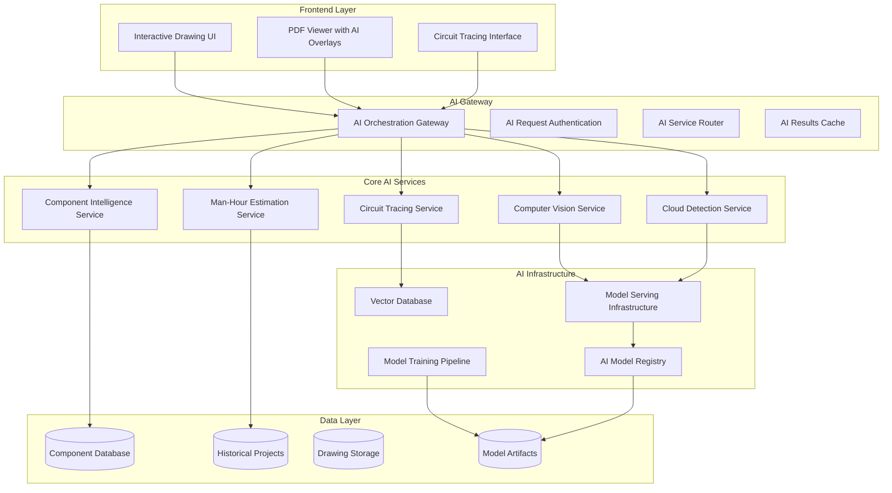
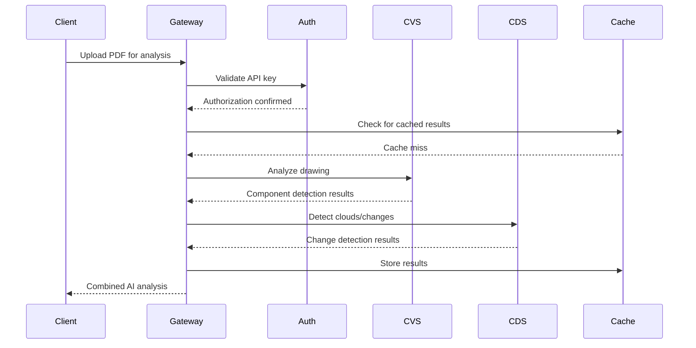

# AI Services Architecture - Electrical Orchestrator
**Document Version:** 1.0  
**Created:** 2025-05-28  
**Architect:** Mo (BMAD Method)  

## Executive Summary

This document defines the comprehensive AI services architecture for the Electrical Orchestrator platform, enabling intelligent PDF drawing analysis, cloud detection, circuit tracing, component recognition, and man-hour estimation for oil & gas electrical projects.

## High-Level AI Architecture Overview



## Core AI Service Components

### 1. Computer Vision Service (CVS)
**Purpose:** Primary PDF analysis and component detection engine

**Technology Stack:**
- **Framework:** Python 3.11+ with FastAPI
- **AI Models:** 
  - YOLO v8/v9 for object detection
  - Custom CNN for electrical component classification
  - OCR: Tesseract + PaddleOCR for text extraction
- **Image Processing:** OpenCV, PIL, pdf2image
- **Model Serving:** TensorFlow Serving / TorchServe

**Key Capabilities:**
- PDF page extraction and preprocessing
- Electrical component bounding box detection
- Component classification (breakers, relays, terminals, etc.)
- Text extraction from component labels
- Confidence scoring and validation

**API Endpoints:**
```
POST /api/v1/cv/analyze-drawing
POST /api/v1/cv/detect-components  
POST /api/v1/cv/extract-text
GET  /api/v1/cv/model-health
```

### 2. Cloud Detection Service (CDS)
**Purpose:** AI-powered identification of new/modified work areas in drawings

**Technology Stack:**
- **Framework:** Python 3.11+ with FastAPI
- **AI Models:**
  - Semantic segmentation model (U-Net/DeepLab)
  - Change detection algorithms
  - Custom cloud/revision detection model
- **Libraries:** OpenCV, scikit-image, NumPy

**Key Capabilities:**
- Cloud/revision area detection and segmentation
- Change highlighting and overlay generation
- Confidence mapping for detected changes
- Historical drawing comparison

**API Endpoints:**
```
POST /api/v1/cloud/detect-changes
POST /api/v1/cloud/generate-overlay
POST /api/v1/cloud/compare-revisions
GET  /api/v1/cloud/confidence-map
```

### 3. Circuit Tracing Service (CTS)
**Purpose:** Interactive electrical path analysis and visualization

**Technology Stack:**
- **Framework:** Python 3.11+ with FastAPI
- **Graph Processing:** NetworkX, PyTorch Geometric
- **Pathfinding:** A* algorithm, Dijkstra's algorithm
- **Vector Storage:** Pinecone / ChromaDB for circuit embeddings

**Key Capabilities:**
- Circuit topology graph construction
- Interactive path tracing from any component
- Connection validation and verification
- Multi-path analysis for complex circuits

**API Endpoints:**
```
POST /api/v1/circuit/trace-path
POST /api/v1/circuit/build-topology
GET  /api/v1/circuit/component-connections
POST /api/v1/circuit/validate-circuit
```

### 4. Component Intelligence Service (CIS)
**Purpose:** Comprehensive electrical component database and recognition

**Technology Stack:**
- **Framework:** Python 3.11+ with FastAPI
- **Database:** PostgreSQL with pgvector extension
- **Search Engine:** Elasticsearch for component search
- **ML Models:** Sentence transformers for semantic search

**Key Capabilities:**
- Component specification lookup
- Manufacturer and model identification
- Electrical characteristic inference
- Cross-reference and compatibility checking

**API Endpoints:**
```
GET  /api/v1/components/search
POST /api/v1/components/identify
GET  /api/v1/components/{id}/specifications
POST /api/v1/components/cross-reference
```

### 5. Man-Hour Estimation Service (MES)
**Purpose:** AI-driven project estimation based on historical data

**Technology Stack:**
- **Framework:** Python 3.11+ with FastAPI  
- **ML Models:** 
  - XGBoost/Random Forest for estimation
  - Time series analysis models
  - Feature engineering pipeline
- **Data Processing:** Pandas, NumPy, scikit-learn

**Key Capabilities:**
- Circuit complexity analysis
- Historical pattern matching
- Role-based hour estimation
- Confidence intervals and risk assessment

**API Endpoints:**
```
POST /api/v1/estimation/analyze-circuit
POST /api/v1/estimation/predict-hours
GET  /api/v1/estimation/historical-patterns
POST /api/v1/estimation/validate-estimate
```

## AI Infrastructure Components

### Model Registry & Serving
**Technology:** MLflow + TensorFlow Serving
- Centralized model versioning and management
- A/B testing capabilities for model updates
- Automated model deployment pipeline
- Performance monitoring and rollback capabilities

### Vector Database
**Technology:** Pinecone or ChromaDB
- Circuit topology embeddings
- Component similarity search
- Drawing feature vectors
- Semantic search capabilities

### Training Pipeline
**Technology:** Kubeflow Pipelines / Apache Airflow
- Automated data preprocessing
- Model training and validation
- Hyperparameter optimization
- Continuous learning from new drawings

## Data Architecture for AI

### Component Intelligence Database
```sql
-- Core component schema
CREATE TABLE components (
    id UUID PRIMARY KEY,
    manufacturer VARCHAR(100),
    model_number VARCHAR(100),
    category electrical_component_type,
    specifications JSONB,
    embedding VECTOR(768),
    created_at TIMESTAMP,
    updated_at TIMESTAMP
);

-- Electrical characteristics
CREATE TABLE component_characteristics (
    component_id UUID REFERENCES components(id),
    voltage_rating INTEGER,
    current_rating INTEGER,
    power_rating DECIMAL,
    frequency_rating DECIMAL,
    environmental_rating VARCHAR(50)
);
```

### Historical Projects Database
```sql
-- Project completion data
CREATE TABLE project_completions (
    id UUID PRIMARY KEY,
    project_id UUID,
    circuit_type VARCHAR(100),
    component_count INTEGER,
    complexity_score DECIMAL,
    actual_hours DECIMAL,
    role electrical_role_type,
    completion_date DATE
);

-- Circuit patterns for ML training
CREATE TABLE circuit_patterns (
    id UUID PRIMARY KEY,
    pattern_hash VARCHAR(64),
    complexity_features JSONB,
    average_hours DECIMAL,
    confidence_score DECIMAL
);
```

## API Gateway & Orchestration

### AI Request Flow


### Performance & Caching Strategy
- **Redis Cluster:** For fast AI result caching (TTL: 24 hours)
- **CDN Integration:** For processed drawing overlays
- **Result Streaming:** WebSocket for real-time AI processing updates
- **Queue Management:** Celery + Redis for background AI tasks

## Security Architecture

### AI-Specific Security Measures
- **Model Protection:** Encrypted model artifacts in storage
- **API Rate Limiting:** Per-user limits for AI service calls
- **Input Validation:** PDF sanitization and size limits
- **Output Filtering:** Confidence thresholds for AI results
- **Audit Logging:** All AI predictions logged with timestamps

### Authentication & Authorization
```python
# AI service authentication
class AIServiceAuth:
    required_permissions = {
        'cv_service': ['drawings.analyze'],
        'cloud_detection': ['drawings.compare'],
        'circuit_tracing': ['circuits.trace'],
        'component_intelligence': ['components.search'],
        'estimation': ['projects.estimate']
    }
```

## Deployment Architecture

### Containerization Strategy
```yaml
# Docker Compose for AI Services
version: '3.8'
services:
  cv-service:
    build: ./src/ai-services/computer-vision
    deploy:
      replicas: 3
      resources:
        limits:
          memory: 4G
          cpus: '2.0'
        reservations:
          devices:
            - driver: nvidia
              count: 1
              capabilities: [gpu]

  model-serving:
    image: tensorflow/serving:2.13.0-gpu
    volumes:
      - ./models:/models
    environment:
      - MODEL_CONFIG_FILE=/models/models.config
```

### Kubernetes Deployment
- **Horizontal Pod Autoscaling:** Based on CPU/memory and queue length
- **GPU Node Pools:** For ML inference workloads
- **Model Serving:** TensorFlow Serving with GPU acceleration
- **Monitoring:** Prometheus + Grafana for AI service metrics

## Development & Testing Strategy

### AI Model Development Workflow
1. **Data Collection:** Annotated electrical drawings dataset
2. **Model Training:** Jupyter notebooks + MLflow tracking
3. **Model Validation:** Holdout test sets + cross-validation
4. **A/B Testing:** Gradual model rollout with performance comparison
5. **Continuous Learning:** Feedback loop from user corrections

### Testing Approach
```python
# Unit testing for AI services
class TestComputerVisionService:
    def test_component_detection_accuracy(self):
        # Test with known drawing samples
        results = cv_service.detect_components(test_drawing)
        assert results.confidence > 0.85
        assert len(results.components) == expected_count

# Integration testing
class TestAIWorkflow:
    def test_end_to_end_analysis(self):
        # Full pipeline test
        upload_result = upload_pdf(test_drawing)
        analysis = analyze_drawing(upload_result.drawing_id)
        assert analysis.status == 'completed'
        assert len(analysis.detected_components) > 0
```

### Performance Benchmarks
- **Component Detection:** >90% accuracy on test dataset
- **Cloud Detection:** >85% precision, >80% recall
- **Circuit Tracing:** <2 second response time for standard circuits
- **Estimation Accuracy:** <15% variance from actual hours

## Integration Points

### Frontend Integration
```typescript
// AI service client interface
interface AIServiceClient {
  analyzeDrawing(drawingId: string): Promise<AnalysisResult>;
  detectClouds(drawingId: string): Promise<CloudDetectionResult>;
  traceCircuit(componentId: string): Promise<CircuitPath>;
  estimateHours(circuitSpecs: CircuitSpecification): Promise<HourEstimate>;
}
```

### Existing Service Integration
- **PDF Processing Service:** Provides preprocessed images to CV service
- **Gateway Service:** Routes AI requests and handles authentication
- **Database Services:** Stores AI results and component data
- **WebSocket Service:** Real-time AI processing updates

## Monitoring & Observability

### AI-Specific Metrics
- **Model Performance:** Accuracy, precision, recall by service
- **Inference Latency:** Response times for each AI service
- **Queue Metrics:** Processing queue lengths and wait times
- **Resource Utilization:** GPU/CPU usage for ML workloads
- **User Feedback:** Correction rates and satisfaction scores

### Health Checks
```python
# AI service health monitoring
@app.get("/health")
async def health_check():
    return {
        "status": "healthy",
        "model_version": model_registry.current_version,
        "gpu_available": torch.cuda.is_available(),
        "queue_length": celery_queue.length(),
        "cache_hit_rate": cache.hit_rate()
    }
```

## Scalability Considerations

### Horizontal Scaling
- **Stateless Services:** All AI services designed for horizontal scaling
- **Load Balancing:** Intelligent routing based on request type and load
- **Auto-scaling:** Kubernetes HPA based on queue metrics
- **Geographic Distribution:** Regional deployment for global access

### Performance Optimization
- **Model Optimization:** TensorRT optimization for NVIDIA GPUs
- **Batch Processing:** Intelligent batching for similar requests
- **Caching Strategy:** Multi-level caching (Redis, CDN, Browser)
- **Async Processing:** Non-blocking AI operations with WebSocket updates

## Future Enhancement Roadmap

### Phase 2 Enhancements (Q3 2025)
- **Advanced Circuit Analysis:** Power flow and load calculations
- **3D Model Integration:** Support for 3D electrical models
- **Real-time Collaboration:** Multi-user circuit analysis
- **Mobile AI:** Optimized models for tablet deployment

### Phase 3 Enhancements (Q4 2025)
- **Federated Learning:** Cross-organization model improvement
- **Advanced Estimation:** Weather and environmental factor integration
- **Predictive Maintenance:** Equipment failure prediction
- **Automated Compliance:** Code compliance checking

## Technical Risks & Mitigation

### Identified Risks
1. **Model Accuracy:** Insufficient training data for specific equipment types
   - **Mitigation:** Synthetic data generation + transfer learning
2. **Performance:** High latency for complex drawings
   - **Mitigation:** Progressive processing + result streaming
3. **Resource Costs:** High GPU costs for inference
   - **Mitigation:** Model optimization + intelligent caching

### Contingency Plans
- **Fallback Models:** Simpler models for high-load scenarios
- **Graceful Degradation:** Manual mode when AI services unavailable
- **Data Recovery:** Comprehensive backup strategy for training data

---

## Conclusion

This AI architecture provides a robust, scalable foundation for intelligent electrical drawing analysis. The microservices approach allows for independent scaling and updates of AI capabilities while maintaining system reliability.

The architecture balances technical excellence with practical implementation constraints, optimizing for the oil & gas industry's specific requirements while enabling future expansion into broader energy sectors.

**Next Recommended Steps:**
1. **Design Architect (Millie)** → Frontend Architecture for AI interfaces
2. **Product Owner (Curly)** → Create implementation stories for AI services
3. **Developer Agents** → Begin with Computer Vision Service implementation