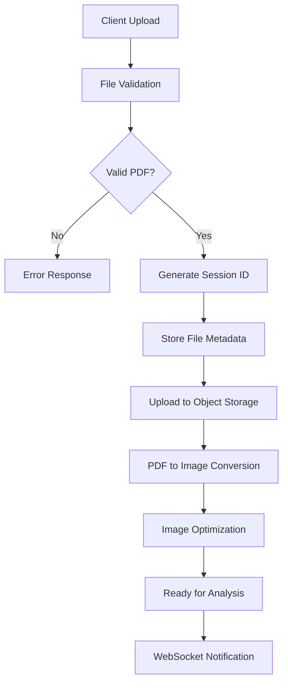
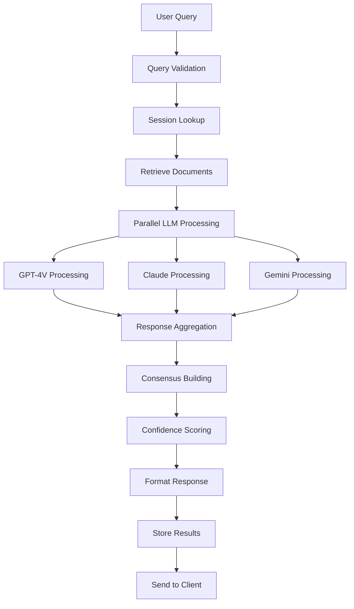

# 4. Data Flow and Processing Pipelines

## 4.1 File Upload and Processing Pipeline



### 4.1.1 File Processing Service
```typescript
// File Processing Pipeline
class FileProcessingPipeline {
  async processUpload(file: Express.Multer.File, sessionId: string): Promise<ProcessedFile> {
    // Stage 1: Validation
    await this.validateFile(file)
    
    // Stage 2: PDF Processing
    const images = await this.convertPDFToImages(file.buffer)
    
    // Stage 3: Image Optimization
    const optimizedImages = await this.optimizeImages(images)
    
    // Stage 4: Storage
    const fileRecord = await this.storeFile(file, sessionId, optimizedImages)
    
    // Stage 5: Notification
    await this.notifyProcessingComplete(sessionId, fileRecord.id)
    
    return fileRecord
  }
  
  private async validateFile(file: Express.Multer.File): Promise<void> {
    if (!file.mimetype.includes('pdf')) {
      throw new ValidationError('Only PDF files are supported')
    }
    
    if (file.size > 10 * 1024 * 1024) {
      throw new ValidationError('File size must be under 10MB')
    }
    
    // Additional validation logic...
  }
  
  private async convertPDFToImages(buffer: Buffer): Promise<Buffer[]> {
    const pdf = await getDocument(buffer).promise
    const images: Buffer[] = []
    
    for (let i = 1; i <= Math.min(pdf.numPages, 3); i++) {
      const page = await pdf.getPage(i)
      const viewport = page.getViewport({ scale: 2.0 })
      const canvas = createCanvas(viewport.width, viewport.height)
      const context = canvas.getContext('2d')
      
      await page.render({ canvasContext: context, viewport }).promise
      images.push(canvas.toBuffer('image/jpeg', { quality: 0.9 }))
    }
    
    return images
  }
}
```

## 4.2 Query Processing Pipeline



### 4.2.1 Query Processing Service
```typescript
// Query Processing Pipeline
class QueryProcessor {
  constructor(
    private llmEnsemble: LLMEnsemble,
    private responseAggregator: ResponseAggregator,
    private sessionManager: SessionManager
  ) {}
  
  async processQuery(query: AnalysisQuery): Promise<AnalysisResult> {
    // Stage 1: Validation and Context
    const session = await this.sessionManager.getSession(query.sessionId)
    const documents = await this.getSessionDocuments(query.sessionId)
    
    // Stage 2: Prepare Images and Prompts
    const images = await this.loadDocumentImages(documents)
    const prompt = await this.buildAnalysisPrompt(query, session.queryHistory)
    
    // Stage 3: Parallel LLM Processing
    const ensembleResponse = await this.llmEnsemble.analyzeWithEnsemble(
      images, 
      prompt, 
      { queryType: query.type }
    )
    
    // Stage 4: Response Processing
    const aggregatedResult = await this.responseAggregator.aggregate(
      ensembleResponse,
      query
    )
    
    // Stage 5: Store and Return
    await this.storeQueryResult(query, aggregatedResult)
    return aggregatedResult
  }
  
  private async buildAnalysisPrompt(query: AnalysisQuery, history: Query[]): Promise<string> {
    const basePrompt = await this.getPromptTemplate(query.type)
    const contextPrompt = this.buildContextFromHistory(history)
    
    return `${basePrompt}\n\nContext from previous queries:\n${contextPrompt}\n\nCurrent question: ${query.text}`
  }
}
```

## 4.3 Response Aggregation Pipeline

```typescript
// Response Aggregation and Consensus
class ResponseAggregator {
  async aggregate(ensembleResponse: EnsembleResponse, query: AnalysisQuery): Promise<AnalysisResult> {
    const responses = ensembleResponse.individual
    
    // Component Analysis Aggregation
    const components = await this.aggregateComponentIdentifications(responses)
    
    // Question Answer Aggregation
    const answer = await this.aggregateTextResponses(responses)
    
    // Confidence Scoring
    const confidence = await this.calculateConfidenceScore(responses, query)
    
    // Schematic Data Aggregation
    const schematicData = await this.aggregateSchematicData(responses)
    
    return {
      answer,
      components,
      schematicData,
      confidence,
      modelComparison: this.buildModelComparison(responses),
      metadata: {
        processingTime: ensembleResponse.metadata.totalTime,
        modelsUsed: responses.map(r => r.model),
        consensus: ensembleResponse.consensus
      }
    }
  }
  
  private async aggregateComponentIdentifications(responses: LLMResponse[]): Promise<ComponentIdentification[]> {
    // Use clustering algorithm to group similar component identifications
    const allComponents = responses.flatMap(r => r.components || [])
    const clusters = await this.clusterComponents(allComponents)
    
    return clusters.map(cluster => ({
      type: this.getMostCommonType(cluster),
      description: this.buildConsensusDescription(cluster),
      location: this.averageLocation(cluster),
      confidence: this.calculateClusterConfidence(cluster)
    }))
  }
  
  private calculateConfidenceScore(responses: LLMResponse[], query: AnalysisQuery): ConfidenceScore {
    const agreement = this.calculateInterModelAgreement(responses)
    const completeness = this.assessResponseCompleteness(responses, query)
    const consistency = this.assessInternalConsistency(responses)
    
    return {
      overall: (agreement * 0.4 + completeness * 0.3 + consistency * 0.3),
      agreement,
      completeness,
      consistency,
      factors: {
        modelConsensus: agreement,
        responseQuality: completeness,
        logicalConsistency: consistency
      }
    }
  }
}
```

---
