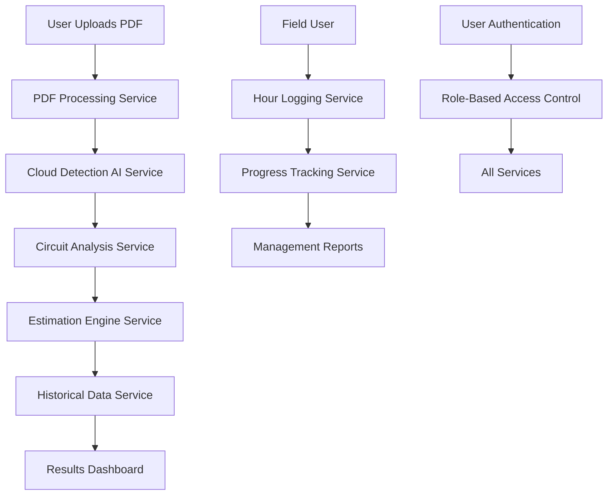
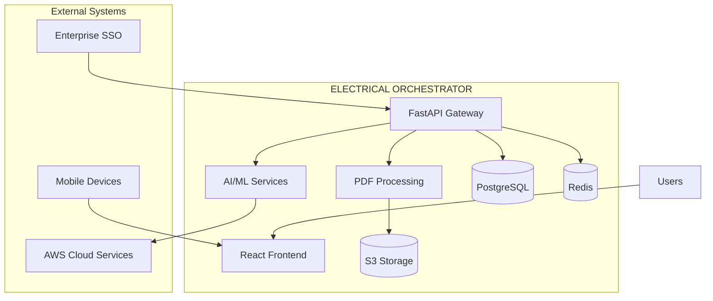
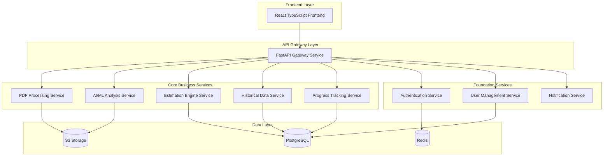
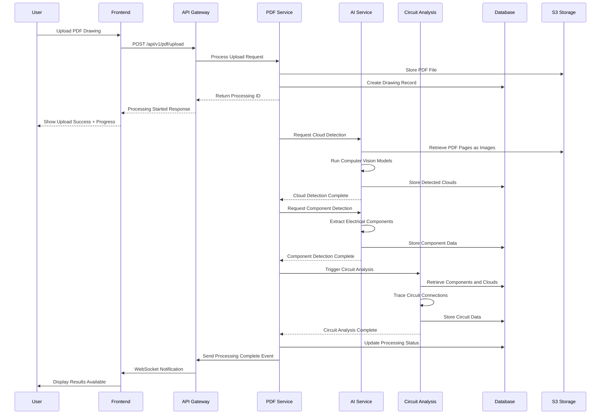

# ELECTRICAL ORCHESTRATOR Architecture Document

## Introduction / Preamble

This document outlines the overall project architecture for the ELECTRICAL ORCHESTRATOR - an AI-powered brownfield electrical estimation platform designed for oil & gas professionals. It serves as the guiding architectural blueprint for AI-driven development, ensuring consistency and adherence to chosen patterns and technologies for transforming static PDF electrical drawings into interactive circuit analysis with accurate man-hour estimation.

**Relationship to Frontend Architecture:**
This project includes a significant professional technical user interface. A separate Frontend Architecture Document (to be created by Design Architect) will detail the frontend-specific design and MUST be used in conjunction with this document. Core technology stack choices documented herein are definitive for the entire project, including all frontend components.

## Technical Summary

The ELECTRICAL ORCHESTRATOR employs a **microservices-within-monorepo architecture** using containerized Python FastAPI services for AI/ML processing and a React TypeScript frontend for professional technical interfaces. The system leverages AWS cloud services for initial development with a designed migration path to on-premise deployment using NVIDIA DGX infrastructure. Core capabilities include automated PDF parsing, computer vision-based cloud detection, interactive circuit tracing, and machine learning-powered estimation algorithms trained on historical project completion data.

## High-Level Overview

### Architectural Style: Microservices within Monorepo

The system adopts a **microservices architecture** contained within a **single repository (monorepo)** to balance modularity with development velocity. This approach provides:

- **Service Independence:** Separate services for PDF processing, circuit analysis, estimation engine, user management, and frontend
- **Shared Resources:** Common types, utilities, and configuration management across services
- **Simplified Deployment:** Coordinated releases with clear service dependencies
- **Development Efficiency:** Unified tooling, testing, and CI/CD pipeline

### Repository Structure Decision
**Monorepo** approach chosen to support:
- Coordinated development of tightly integrated AI/ML services
- Shared TypeScript interfaces between frontend and backend
- Simplified dependency management for complex technical workflows
- Clear migration path from cloud to on-premise deployment

### Primary Data Flow (Conceptual)



**Core User Interaction Flow:**
1. **Upload Phase:** Professional user uploads PDF electrical drawings through secure web interface
2. **Analysis Phase:** AI services automatically detect clouded areas and parse electrical components
3. **Exploration Phase:** User interactively explores circuits through click-to-trace functionality
4. **Estimation Phase:** ML algorithms generate man-hour estimates based on historical project data
5. **Tracking Phase:** Field teams log actual hours against specific circuits and components
6. **Reporting Phase:** Management accesses real-time progress and accuracy metrics

### System Context Diagram



## Architectural / Design Patterns Adopted

**Pattern 1: Domain-Driven Design (DDD) - Service Boundaries**
- _Rationale:_ Electrical estimation involves distinct domains (PDF processing, circuit analysis, historical data, user management) that benefit from clear service boundaries and domain expertise

**Pattern 2: Event-Driven Architecture - Asynchronous Processing**  
- _Rationale:_ PDF processing and AI analysis are computationally intensive, requiring asynchronous workflows with progress tracking and failure recovery

**Pattern 3: API Gateway Pattern - Unified Interface**
- _Rationale:_ Multiple backend services need coordinated access control, rate limiting, and request routing for both web and future mobile clients

**Pattern 4: Repository Pattern - Data Access Abstraction**
- _Rationale:_ Historical project data comes from varied sources; abstraction enables flexible data integration and testing

**Pattern 5: Strategy Pattern - AI/ML Algorithm Selection**
- _Rationale:_ Multiple AI approaches (computer vision vs LLM, different estimation algorithms) need runtime selection based on data quality and user preferences

**Pattern 6: Circuit Breaker Pattern - External Service Resilience**
- _Rationale:_ Dependencies on AWS AI services and potential enterprise integrations require fault tolerance and graceful degradation

## Component View

### Core Services Architecture



### Service Responsibilities

**Frontend Layer:**
- **React TypeScript Frontend:** Professional technical interface for electrical analysis, circuit tracing, estimation review, and project management with responsive design for desktop and mobile use

**API Gateway Layer:**
- **FastAPI Gateway Service:** Unified API endpoint, authentication enforcement, rate limiting, request routing, CORS handling, and API documentation generation

**Core Business Services:**

- **PDF Processing Service:** 
  - PDF upload handling and validation
  - Text extraction using AWS Textract
  - Drawing metadata parsing and component identification
  - Coordinate mapping for interactive elements

- **AI/ML Analysis Service:**
  - Computer vision-based cloud detection using custom models
  - Circuit component classification and recognition
  - Drawing quality assessment and confidence scoring
  - Integration with AWS AI services and future DGX deployment

- **Estimation Engine Service:**
  - Circuit complexity analysis algorithms
  - Pattern matching against historical project data
  - Machine learning-based man-hour prediction models
  - Confidence scoring and range estimation calculations

- **Historical Data Service:**
  - Import and standardization of legacy project data
  - Pattern recognition for similar project identification
  - Performance metrics calculation and trend analysis
  - Data quality assessment and gap identification

- **Progress Tracking Service:**
  - Real-time hour logging and validation
  - Progress calculation against estimates
  - Variance analysis and performance metrics
  - Alert generation for schedule deviations

**Foundation Services:**

- **Authentication Service:**
  - Enterprise SSO integration (SAML/LDAP)
  - JWT token management and validation
  - Session handling and security enforcement
  - Role-based access control implementation

- **User Management Service:**
  - User profile management across 7 defined roles
  - Team assignment and project access control
  - Preference management and customization
  - Audit logging for user activities

- **Notification Service:**
  - Real-time status updates for processing operations
  - Email/SMS notifications for critical events
  - Progress alerts and milestone notifications
  - System health and error notifications

**Data Layer:**
- **PostgreSQL:** Primary relational database for projects, users, estimates, tracking data
- **Redis:** Caching layer for session management, job queues, and frequent queries
- **S3 Storage:** Scalable file storage for PDF drawings, processed images, and historical documents

## Project Structure

```plaintext
electrical-orchestrator/
├── .github/                    # CI/CD workflows and GitHub configuration
│   └── workflows/
│       ├── main.yml           # Main CI/CD pipeline
│       ├── security.yml       # Security scanning workflow
│       └── deploy.yml         # Deployment workflow
├── .vscode/                    # VSCode settings for development
│   ├── settings.json
│   ├── launch.json           # Debug configurations
│   └── extensions.json       # Recommended extensions
├── docs/                       # Project documentation
│   ├── index.md              # Documentation index
│   ├── project-brief.md
│   ├── electrical-orchestrator-prd.md
│   ├── front-end-spec.md
│   ├── electrical-orchestrator-architecture.md
│   ├── pm-checklist-results.md
│   └── deep-research-prompt.md
├── infra/                      # Infrastructure as Code (AWS CDK)
│   ├── lib/
│   │   ├── api-stack.ts      # API Gateway and Lambda functions
│   │   ├── data-stack.ts     # Database and storage resources
│   │   └── ml-stack.ts       # AI/ML service infrastructure
│   ├── bin/
│   │   └── infra.ts          # CDK app entry point
│   └── cdk.json              # CDK configuration
├── scripts/                    # Utility scripts
│   ├── dev-setup.sh          # Development environment setup
│   ├── deploy.sh             # Deployment helper
│   ├── test.sh               # Test runner script
│   └── data-migration.py     # Historical data import tools
├── src/                        # Application source code
│   ├── frontend/              # React TypeScript frontend (detailed in Frontend Architecture)
│   │   ├── components/        # Reusable UI components
│   │   ├── pages/            # Main application pages
│   │   ├── hooks/            # Custom React hooks
│   │   ├── services/         # API service clients
│   │   ├── types/            # TypeScript type definitions
│   │   ├── utils/            # Frontend utilities
│   │   └── main.tsx          # Frontend entry point
│   ├── backend/               # Backend services
│   │   ├── gateway/          # FastAPI Gateway Service
│   │   │   ├── main.py       # Gateway entry point
│   │   │   ├── routes/       # API route definitions
│   │   │   ├── middleware/   # Authentication, CORS, rate limiting
│   │   │   └── utils/        # Gateway utilities
│   │   ├── services/         # Microservices
│   │   │   ├── pdf-processing/
│   │   │   │   ├── main.py   # Service entry point
│   │   │   │   ├── handlers/ # PDF processing logic
│   │   │   │   ├── models/   # Data models
│   │   │   │   └── utils/    # Service utilities
│   │   │   ├── ai-analysis/
│   │   │   │   ├── main.py
│   │   │   │   ├── models/   # AI/ML model implementations
│   │   │   │   ├── computer_vision/ # CV algorithms
│   │   │   │   └── cloud_detection/ # Cloud detection logic
│   │   │   ├── estimation-engine/
│   │   │   │   ├── main.py
│   │   │   │   ├── algorithms/ # Estimation algorithms
│   │   │   │   ├── ml_models/  # ML model implementations
│   │   │   │   └── historical_analysis/ # Historical data analysis
│   │   │   ├── historical-data/
│   │   │   │   ├── main.py
│   │   │   │   ├── importers/ # Data import utilities
│   │   │   │   ├── analyzers/ # Pattern analysis
│   │   │   │   └── validators/ # Data quality checks
│   │   │   ├── progress-tracking/
│   │   │   │   ├── main.py
│   │   │   │   ├── hour_logging/ # Time tracking logic
│   │   │   │   ├── analytics/ # Progress analytics
│   │   │   │   └── alerts/    # Alert generation
│   │   │   ├── authentication/
│   │   │   │   ├── main.py
│   │   │   │   ├── sso/      # SSO integration
│   │   │   │   ├── jwt/      # JWT handling
│   │   │   │   └── rbac/     # Role-based access control
│   │   │   ├── user-management/
│   │   │   │   ├── main.py
│   │   │   │   ├── profiles/ # User profile management
│   │   │   │   ├── teams/    # Team management
│   │   │   │   └── audit/    # Audit logging
│   │   │   └── notifications/
│   │   │       ├── main.py
│   │   │       ├── email/    # Email notifications
│   │   │       ├── realtime/ # Real-time updates
│   │   │       └── alerts/   # Alert management
│   │   ├── shared/           # Shared code across services
│   │   │   ├── models/       # Common data models
│   │   │   ├── database/     # Database utilities
│   │   │   ├── redis/        # Redis utilities
│   │   │   ├── s3/           # S3 utilities
│   │   │   ├── auth/         # Authentication utilities
│   │   │   ├── validation/   # Input validation
│   │   │   ├── logging/      # Logging configuration
│   │   │   └── config/       # Configuration management
│   │   └── docker/           # Docker configurations
│   │       ├── Dockerfile.gateway
│   │       ├── Dockerfile.services
│   │       └── docker-compose.yml
├── tests/                      # Automated tests
│   ├── unit/                  # Unit tests (mirroring src structure)
│   │   ├── backend/
│   │   │   ├── services/
│   │   │   └── shared/
│   │   └── frontend/
│   ├── integration/           # Integration tests
│   │   ├── api/              # API integration tests
│   │   ├── database/         # Database integration tests
│   │   └── ai_models/        # AI/ML model tests
│   └── e2e/                  # End-to-end tests
│       ├── workflows/        # Complete user workflow tests
│       └── performance/      # Performance and load tests
├── ml-models/                 # Machine learning assets
│   ├── training/             # Model training scripts
│   ├── datasets/             # Training datasets (gitignored, large files)
│   ├── experiments/          # ML experiment tracking
│   └── deployment/           # Model deployment configurations
├── .env.example              # Example environment variables
├── .gitignore                # Git ignore rules
├── requirements.txt          # Python dependencies
├── package.json              # Frontend dependencies and scripts
├── pyproject.toml            # Python project configuration
├── docker-compose.yml        # Local development orchestration
└── README.md                 # Project overview and setup
```

### Key Directory Descriptions

**Core Directories:**
- **docs/:** Contains all project planning and reference documentation following BMAD methodology
- **infra/:** AWS CDK Infrastructure as Code for automated cloud resource management
- **src/frontend/:** React TypeScript frontend with professional electrical interface components
- **src/backend/services/:** Individual microservices with clear domain boundaries
- **src/backend/shared/:** Common utilities, models, and configuration shared across services
- **tests/:** Comprehensive testing suite with unit, integration, and E2E coverage
- **ml-models/:** Machine learning assets for training, experiments, and deployment

**Service Structure Pattern:**
Each microservice follows consistent structure:
- **main.py:** Service entry point with FastAPI application
- **handlers/ or logic/:** Core business logic implementation
- **models/:** Pydantic data models and database schemas
- **utils/:** Service-specific utilities and helpers

**Shared Resources:**
- **src/backend/shared/:** Common database models, authentication, logging, and configuration
- **src/frontend/types/:** Shared TypeScript interfaces between frontend and backend
- **tests/:** Parallel testing structure mirroring source organization

### Container Architecture Notes

- **Development:** docker-compose.yml orchestrates all services locally with hot reload
- **Production:** Individual service containers with Kubernetes/ECS orchestration
- **AI/ML Services:** Separate containers optimized for GPU processing (future DGX deployment)
- **Frontend:** Static build served via CDN with API gateway integration

## API Reference

### External APIs Consumed

#### AWS Textract API

- **Purpose:** Extract text and structural information from PDF electrical drawings
- **Base URL(s):**
  - Production: `https://textract.us-east-1.amazonaws.com`
  - Staging/Dev: `https://textract.us-east-1.amazonaws.com`
- **Authentication:** AWS IAM roles with Textract permissions (reference `docs/environment-vars.md` for role ARNs)
- **Key Endpoints Used:**
  - **`POST /analyze-document`:**
    - Description: Analyzes PDF documents for text extraction and layout detection
    - Request Parameters: DocumentLocation (S3 bucket/key), FeatureTypes
    - Request Body Schema: 
      ```json
      {
        "Document": {"S3Object": {"Bucket": "string", "Name": "string"}},
        "FeatureTypes": ["TABLES", "FORMS"]
      }
      ```
    - Success Response Schema (Code: `200 OK`): Blocks array with text, geometry, relationships
    - Error Response Schema (Codes: `4xx`, `5xx`): AWS standard error format with error codes
- **Rate Limits:** 15 requests per second for standard tier
- **Link to Official Docs:** https://docs.aws.amazon.com/textract/

#### AWS Rekognition Custom Labels API

- **Purpose:** Custom computer vision models for electrical component and cloud detection
- **Base URL(s):**
  - Production: `https://rekognition.us-east-1.amazonaws.com`
  - Staging/Dev: `https://rekognition.us-east-1.amazonaws.com`
- **Authentication:** AWS IAM roles with Rekognition permissions
- **Key Endpoints Used:**
  - **`POST /detect-custom-labels`:**
    - Description: Detects custom objects (clouded areas, electrical components) in images
    - Request Body Schema:
      ```json
      {
        "Image": {"S3Object": {"Bucket": "string", "Name": "string"}},
        "ProjectVersionArn": "string",
        "MinConfidence": 80
      }
      ```
    - Success Response Schema (Code: `200 OK`): CustomLabels array with Name, Confidence, Geometry
- **Rate Limits:** 5 transactions per second for custom models
- **Link to Official Docs:** https://docs.aws.amazon.com/rekognition/

### Internal APIs Provided

#### PDF Processing Service API

- **Purpose:** Handle PDF upload, processing, and component extraction for electrical drawings
- **Base URL(s):** `/api/v1/pdf`
- **Authentication/Authorization:** JWT token required, role-based access for upload permissions
- **Endpoints:**
  - **`POST /upload`:**
    - Description: Upload and process electrical drawing PDFs
    - Request Parameters: project_id (query), drawing_type (query)
    - Request Body Schema: multipart/form-data with file upload
    - Success Response Schema (Code: `200 OK`):
      ```json
      {
        "processing_id": "uuid",
        "status": "processing",
        "estimated_completion": "ISO-8601-datetime"
      }
      ```
  - **`GET /status/{processing_id}`:**
    - Description: Get processing status and results
    - Success Response Schema (Code: `200 OK`):
      ```json
      {
        "status": "completed|processing|failed",
        "progress": 85,
        "components_detected": 45,
        "clouds_detected": 3,
        "download_url": "signed-s3-url"
      }
      ```

#### Circuit Analysis Service API

- **Purpose:** Interactive circuit tracing and component analysis functionality
- **Base URL(s):** `/api/v1/circuits`
- **Authentication/Authorization:** JWT token required, project access validation
- **Endpoints:**
  - **`POST /trace`:**
    - Description: Trace electrical circuit from selected component
    - Request Body Schema:
      ```json
      {
        "drawing_id": "uuid",
        "component_id": "string",
        "start_coordinates": {"x": 100, "y": 200}
      }
      ```
    - Success Response Schema (Code: `200 OK`):
      ```json
      {
        "circuit_path": [
          {"component_id": "PLC001", "type": "plc", "connections": ["CTB001"]},
          {"component_id": "CTB001", "type": "terminal_block", "connections": ["ITB001"]}
        ],
        "complexity_score": 7.5
      }
      ```

#### Estimation Engine Service API

- **Purpose:** Generate man-hour estimates based on circuit analysis and historical data
- **Base URL(s):** `/api/v1/estimates`
- **Authentication/Authorization:** JWT token required, electrical lead role or higher
- **Endpoints:**
  - **`POST /generate`:**
    - Description: Generate man-hour estimates for analyzed circuits
    - Request Body Schema:
      ```json
      {
        "project_id": "uuid",
        "circuits": ["circuit_id_1", "circuit_id_2"],
        "estimation_method": "ml_model|historical_average"
      }
      ```
    - Success Response Schema (Code: `200 OK`):
      ```json
      {
        "estimate_id": "uuid",
        "total_hours": 120.5,
        "breakdown_by_role": {
          "electrician": 80.0,
          "electrical_lead": 25.5,
          "fco_tech": 15.0
        },
        "confidence_score": 0.87,
        "similar_projects": ["proj_id_1", "proj_id_2"]
      }
      ```

## Data Models

### Core Application Entities

#### Project

- **Description:** Represents a brownfield electrical project with associated drawings and estimates
- **Schema / Interface Definition:**
  ```typescript
  export interface Project {
    id: string; // UUID primary key
    name: string; // Project display name
    description?: string; // Project description
    client_id: string; // Client organization identifier
    status: 'planning' | 'active' | 'completed' | 'archived'; // Project lifecycle status
    created_at: Date; // Project creation timestamp
    updated_at: Date; // Last modification timestamp
    team_members: TeamMember[]; // Assigned team members with roles
    settings: ProjectSettings; // Project-specific configuration
  }

  export interface TeamMember {
    user_id: string;
    role: 'electrical_lead' | 'electrician' | 'fco_lead' | 'fco_tech' | 'foreman' | 'general_foreman' | 'superintendent';
    assigned_at: Date;
  }

  export interface ProjectSettings {
    estimation_method: 'ml_model' | 'historical_average' | 'hybrid';
    confidence_threshold: number; // Minimum confidence for auto-approval
    notification_preferences: NotificationSettings;
  }
  ```
- **Validation Rules:** Name max 255 chars, status must be valid enum, team_members minimum 1 electrical_lead

#### Drawing

- **Description:** Electrical drawing PDF with processed metadata and component information
- **Schema / Interface Definition:**
  ```typescript
  export interface Drawing {
    id: string; // UUID primary key
    project_id: string; // Foreign key to Project
    filename: string; // Original filename
    file_path: string; // S3 storage path
    file_size: number; // File size in bytes
    page_count: number; // Number of pages in PDF
    upload_timestamp: Date; // When drawing was uploaded
    processing_status: 'uploaded' | 'processing' | 'completed' | 'failed'; // Processing state
    detected_clouds: CloudArea[]; // AI-detected cloud areas
    detected_components: ElectricalComponent[]; // Extracted electrical components
    metadata: DrawingMetadata; // CAD system metadata and drawing properties
  }

  export interface CloudArea {
    id: string;
    coordinates: BoundingBox; // x, y, width, height
    confidence_score: number; // AI detection confidence 0-1
    manual_override?: boolean; // User manually adjusted detection
  }

  export interface ElectricalComponent {
    id: string;
    type: 'plc' | 'terminal_block' | 'instrument' | 'relay' | 'motor' | 'cable' | 'junction_box';
    coordinates: Point; // Center point coordinates
    specifications: ComponentSpecs; // Technical specifications
    connections: string[]; // Connected component IDs
  }
  ```

#### Circuit

- **Description:** Analyzed electrical circuit with tracing information and complexity metrics
- **Schema / Interface Definition:**
  ```typescript
  export interface Circuit {
    id: string; // UUID primary key
    drawing_id: string; // Foreign key to Drawing
    name: string; // Circuit identifier (e.g., "PLC001-CTB005-ITB012")
    components: ElectricalComponent[]; // Components in circuit path
    start_component_id: string; // Circuit starting point
    end_component_id: string; // Circuit ending point
    circuit_type: 'analog_instrument' | 'digital_io' | 'motor_control' | 'communication'; // Circuit classification
    complexity_score: number; // Calculated complexity 1-10
    path_coordinates: Point[]; // Visual circuit path for UI display
    analysis_timestamp: Date; // When circuit was analyzed
  }
  ```

#### Estimate

- **Description:** Generated man-hour estimate for project work with confidence metrics
- **Schema / Interface Definition:**
  ```typescript
  export interface Estimate {
    id: string; // UUID primary key
    project_id: string; // Foreign key to Project
    circuits: string[]; // Circuit IDs included in estimate
    total_hours: number; // Total estimated man-hours
    breakdown_by_role: RoleHourBreakdown; // Hours by team role
    estimation_method: 'ml_model' | 'historical_average' | 'hybrid'; // Algorithm used
    confidence_score: number; // Estimate confidence 0-1
    similar_projects: string[]; // Historical project IDs used for estimation
    created_by: string; // User ID who generated estimate
    approved_by?: string; // User ID who approved estimate
    created_at: Date; // Estimate generation timestamp
    approved_at?: Date; // Approval timestamp
  }

  export interface RoleHourBreakdown {
    electrician: number;
    electrical_lead: number;
    fco_tech: number;
    fco_lead: number;
    foreman: number;
    general_foreman: number;
    superintendent: number;
  }
  ```

#### HourLog

- **Description:** Actual work hours logged by field teams against specific circuits
- **Schema / Interface Definition:**
  ```typescript
  export interface HourLog {
    id: string; // UUID primary key
    user_id: string; // Foreign key to User
    project_id: string; // Foreign key to Project
    circuit_id: string; // Foreign key to Circuit
    hours: number; // Actual hours worked
    work_date: Date; // Date work was performed
    description?: string; // Work description/notes
    status: 'started' | 'in_progress' | 'completed' | 'on_hold'; // Work status
    photos?: string[]; // S3 paths to work progress photos
    logged_at: Date; // When hours were logged in system
  }
  ```

### Database Schemas

#### projects table

- **Purpose:** Store project information and metadata
- **Schema Definition:**
  ```sql
  CREATE TABLE projects (
    id UUID PRIMARY KEY DEFAULT gen_random_uuid(),
    name VARCHAR(255) NOT NULL,
    description TEXT,
    client_id VARCHAR(255) NOT NULL,
    status VARCHAR(50) NOT NULL CHECK (status IN ('planning', 'active', 'completed', 'archived')),
    settings JSONB DEFAULT '{}',
    created_at TIMESTAMP WITH TIME ZONE DEFAULT NOW(),
    updated_at TIMESTAMP WITH TIME ZONE DEFAULT NOW(),
    CONSTRAINT projects_name_unique UNIQUE (name, client_id)
  );

  CREATE INDEX idx_projects_status ON projects(status);
  CREATE INDEX idx_projects_client ON projects(client_id);
  ```

#### drawings table

- **Purpose:** Store electrical drawing files and processing metadata
- **Schema Definition:**
  ```sql
  CREATE TABLE drawings (
    id UUID PRIMARY KEY DEFAULT gen_random_uuid(),
    project_id UUID NOT NULL REFERENCES projects(id) ON DELETE CASCADE,
    filename VARCHAR(255) NOT NULL,
    file_path VARCHAR(512) NOT NULL,
    file_size BIGINT NOT NULL,
    page_count INTEGER NOT NULL,
    processing_status VARCHAR(50) NOT NULL DEFAULT 'uploaded',
    detected_clouds JSONB DEFAULT '[]',
    detected_components JSONB DEFAULT '[]',
    metadata JSONB DEFAULT '{}',
    upload_timestamp TIMESTAMP WITH TIME ZONE DEFAULT NOW(),
    processed_at TIMESTAMP WITH TIME ZONE
  );

  CREATE INDEX idx_drawings_project ON drawings(project_id);
  CREATE INDEX idx_drawings_status ON drawings(processing_status);
  ```

#### circuits table

- **Purpose:** Store analyzed circuit information and tracing data
- **Schema Definition:**
  ```sql
  CREATE TABLE circuits (
    id UUID PRIMARY KEY DEFAULT gen_random_uuid(),
    drawing_id UUID NOT NULL REFERENCES drawings(id) ON DELETE CASCADE,
    name VARCHAR(255) NOT NULL,
    components JSONB NOT NULL DEFAULT '[]',
    start_component_id VARCHAR(255) NOT NULL,
    end_component_id VARCHAR(255) NOT NULL,
    circuit_type VARCHAR(50) NOT NULL,
    complexity_score DECIMAL(3,1) CHECK (complexity_score >= 1 AND complexity_score <= 10),
    path_coordinates JSONB DEFAULT '[]',
    analysis_timestamp TIMESTAMP WITH TIME ZONE DEFAULT NOW()
  );

  CREATE INDEX idx_circuits_drawing ON circuits(drawing_id);
  CREATE INDEX idx_circuits_type ON circuits(circuit_type);
  CREATE INDEX idx_circuits_complexity ON circuits(complexity_score);
  ```

#### estimates table

- **Purpose:** Store generated man-hour estimates and confidence metrics
- **Schema Definition:**
  ```sql
  CREATE TABLE estimates (
    id UUID PRIMARY KEY DEFAULT gen_random_uuid(),
    project_id UUID NOT NULL REFERENCES projects(id) ON DELETE CASCADE,
    circuits JSONB NOT NULL DEFAULT '[]',
    total_hours DECIMAL(8,2) NOT NULL CHECK (total_hours > 0),
    breakdown_by_role JSONB NOT NULL,
    estimation_method VARCHAR(50) NOT NULL,
    confidence_score DECIMAL(3,2) CHECK (confidence_score >= 0 AND confidence_score <= 1),
    similar_projects JSONB DEFAULT '[]',
    created_by UUID NOT NULL,
    approved_by UUID,
    created_at TIMESTAMP WITH TIME ZONE DEFAULT NOW(),
    approved_at TIMESTAMP WITH TIME ZONE
  );

  CREATE INDEX idx_estimates_project ON estimates(project_id);
  CREATE INDEX idx_estimates_confidence ON estimates(confidence_score);
  CREATE INDEX idx_estimates_created_by ON estimates(created_by);
  ```

#### hour_logs table

- **Purpose:** Store actual work hours logged by field teams
- **Schema Definition:**
  ```sql
  CREATE TABLE hour_logs (
    id UUID PRIMARY KEY DEFAULT gen_random_uuid(),
    user_id UUID NOT NULL,
    project_id UUID NOT NULL REFERENCES projects(id) ON DELETE CASCADE,
    circuit_id UUID NOT NULL REFERENCES circuits(id) ON DELETE CASCADE,
    hours DECIMAL(4,2) NOT NULL CHECK (hours > 0 AND hours <= 24),
    work_date DATE NOT NULL,
    description TEXT,
    status VARCHAR(50) NOT NULL DEFAULT 'completed',
    photos JSONB DEFAULT '[]',
    logged_at TIMESTAMP WITH TIME ZONE DEFAULT NOW()
  );

  CREATE INDEX idx_hour_logs_user ON hour_logs(user_id);
  CREATE INDEX idx_hour_logs_project ON hour_logs(project_id);
  CREATE INDEX idx_hour_logs_circuit ON hour_logs(circuit_id);
  CREATE INDEX idx_hour_logs_work_date ON hour_logs(work_date);
  ```

## Core Workflow / Sequence Diagrams

### PDF Processing and Circuit Analysis Workflow



### Estimation Generation and Approval Workflow

```mermaid
sequenceDiagram
    participant EL as Electrical Lead
    participant FE as Frontend
    participant GW as API Gateway
    participant EST as Estimation Engine
    participant HIST as Historical Data Service
    parameter DB as Database

    EL->>FE: Request Estimate Generation
    FE->>GW: POST /api/v1/estimates/generate
    GW->>EST: Generate Estimate Request
    
    EST->>DB: Retrieve Circuit Data
    EST->>HIST: Find Similar Projects
    HIST->>DB: Query Historical Completion Data
    HIST-->>EST: Return Similar Project Metrics
    
    EST->>EST: Run ML Estimation Models
    EST->>EST: Calculate Confidence Scores
    EST->>DB: Store Estimate Results
    EST-->>GW: Return Estimate Data
    
    GW-->>FE: Estimate Generated Response
    FE->>FE: Display Estimate for Review
    FE-->>EL: Show Estimate with Confidence

    EL->>FE: Review and Approve Estimate
    FE->>GW: POST /api/v1/estimates/{id}/approve
    GW->>EST: Process Approval
    EST->>DB: Update Estimate Status
    EST-->>GW: Approval Confirmed
    GW-->>FE: Approval Success
    FE-->>EL: Estimate Approved Notification
```

## Definitive Tech Stack Selections

| Category | Technology | Version / Details | Description / Purpose | Justification |
|:---------|:-----------|:------------------|:---------------------|:-------------|
| **Languages** | TypeScript | 5.3.x | Frontend and shared interfaces | Type safety for complex electrical data |
| | Python | 3.11.x | Backend services and AI/ML | Rich AI/ML ecosystem, PDF processing |
| **Runtime** | Node.js | 20.x | Frontend build and development | Latest LTS for TypeScript support |
| | Python | 3.11.x | Backend service runtime | Stable version with AI/ML library support |
| **Frontend Framework** | React | 18.x | UI component library | Professional interface patterns |
| | Next.js | 14.x | React framework with SSR | Performance optimization, SEO |
| **Backend Framework** | FastAPI | 0.104.x | API service framework | High performance, automatic docs |
| **Databases** | PostgreSQL | 15.x | Primary relational data store | JSONB support, reliability |
| | Redis | 7.x | Caching and session storage | Performance, job queues |
| **Cloud Platform** | AWS | N/A | Primary cloud provider | AI/ML services, enterprise features |
| **Cloud Services** | AWS Textract | N/A | PDF text extraction | Technical drawing processing |
| | AWS Rekognition | N/A | Custom computer vision | Cloud detection, component recognition |
| | AWS S3 | N/A | Object storage for files | PDF storage, processed images |
| | AWS RDS | N/A | Managed PostgreSQL | Database hosting, backups |
| | AWS ElastiCache | N/A | Managed Redis | Caching, session management |
| **Infrastructure** | AWS CDK | 2.x | Infrastructure as Code | TypeScript-based IaC |
| | Docker | 24.x | Containerization | Service isolation, deployment |
| **AI/ML Libraries** | TensorFlow | 2.14.x | Machine learning framework | Custom model training |
| | OpenCV | 4.8.x | Computer vision processing | Image processing, geometric analysis |
| | scikit-learn | 1.3.x | Traditional ML algorithms | Statistical estimation models |
| **PDF Processing** | PyMuPDF (Fitz) | 1.23.x | PDF parsing and rendering | High-performance PDF processing |
| | pdfplumber | 0.10.x | PDF text and table extraction | Structured data extraction |
| **UI Libraries** | Tailwind CSS | 3.3.x | Utility-first CSS framework | Consistent professional styling |
| | Headless UI | 1.7.x | Unstyled accessible components | Professional technical interfaces |
| | React Hook Form | 7.47.x | Form state management | Complex form handling |
| **State Management** | Zustand | 4.4.x | Lightweight state management | Simple, TypeScript-friendly |
| **HTTP Client** | Axios | 1.6.x | HTTP requests with interceptors | API communication, error handling |
| **Database ORM** | SQLAlchemy | 2.0.x | Python ORM with async support | Database abstraction, migrations |
| | Alembic | 1.12.x | Database migration tool | Schema version control |
| **Testing** | Jest | 29.x | JavaScript/TypeScript testing | Unit and integration tests |
| | Playwright | 1.40.x | End-to-end testing framework | Cross-browser E2E testing |
| | pytest | 7.4.x | Python testing framework | Backend service testing |
| | pytest-asyncio | 0.21.x | Async testing support | FastAPI async endpoint testing |
| **Development Tools** | ESLint | 8.54.x | TypeScript/JavaScript linting | Code quality enforcement |
| | Prettier | 3.1.x | Code formatting | Consistent code style |
| | Black | 23.11.x | Python code formatting | Python code consistency |
| | MyPy | 1.7.x | Python static type checking | Type safety enforcement |
| **CI/CD** | GitHub Actions | N/A | Continuous Integration/Deployment | Automated testing, deployment |
| **Monitoring** | Sentry | 1.38.x | Error tracking and monitoring | Production error monitoring |
| | Prometheus | 2.47.x | Metrics collection | Performance monitoring |

## Infrastructure and Deployment Overview

- **Cloud Provider:** AWS (primary) with designed migration path to on-premise NVIDIA DGX infrastructure
- **Core Services Used:** ECS for container orchestration, RDS for PostgreSQL, ElastiCache for Redis, S3 for file storage, Textract and Rekognition for AI services
- **Infrastructure as Code:** AWS CDK with TypeScript - Location: `/infra` directory
- **Deployment Strategy:** CI/CD pipeline with automated testing, staged deployments (dev → staging → production), blue/green deployments for zero-downtime updates
- **Environments:** Development (local Docker), Staging (AWS ECS), Production (AWS ECS with enterprise security)
- **Environment Promotion:** `dev` → `staging` (automated on PR merge with tests passing) → `production` (manual approval after staging validation)
- **Rollback Strategy:** Automated rollback on health check failure, manual trigger via GitHub Actions, ECS service rollback with previous task definition

## Error Handling Strategy

- **General Approach:** Python exceptions as primary mechanism with custom error hierarchy, FastAPI exception handlers for API responses, React Error Boundaries for frontend error containment
- **Logging:**
  - Library/Method: Python `structlog` with JSON formatting, frontend console logging with Sentry integration
  - Format: JSON structured logs with correlation IDs, user context, service name, operation name
  - Levels: DEBUG (development), INFO (normal operations), WARN (recoverable issues), ERROR (failures), CRITICAL (system failures)
  - Context: Correlation ID, User ID (sanitized), Service Name, Operation Name, Circuit/Project IDs where applicable
- **Specific Handling Patterns:**
  - External API Calls: Exponential backoff retry using `tenacity` library (max 3 retries), circuit breaker pattern using `circuitbreaker` library, 30-second connect timeout, 60-second read timeout
  - Internal Errors: Custom exception classes inheriting from base `ElectricalOrchestratorError`, specific exceptions for PDF processing, AI model failures, database constraints
  - Transaction Management: PostgreSQL transactions with explicit rollback on failures, SQLAlchemy session management with automatic cleanup, Redis pipeline operations for atomic cache updates

## Coding Standards

- **Primary Runtime:** Python 3.11.x for backend services, Node.js 20.x for frontend development
- **Style Guide & Linter:** ESLint with TypeScript strict config + Prettier for frontend; Black, Flake8, MyPy for Python backend. Configuration files: `.eslintrc.js`, `pyproject.toml`
- **Naming Conventions:**
  - Variables: `camelCase` (TypeScript), `snake_case` (Python)
  - Functions/Methods: `camelCase` (TypeScript), `snake_case` (Python)
  - Classes/Types/Interfaces: `PascalCase` (both languages)
  - Constants: `UPPER_SNAKE_CASE` (both languages)
  - Files: `kebab-case.ts` (TypeScript), `snake_case.py` (Python)
  - Modules/Packages: `camelCase` (TypeScript), `snake_case` (Python)
- **File Structure:** Adhere to monorepo layout defined in Project Structure section
- **Unit Test File Organization:** `*.test.ts` co-located with source files (TypeScript), `test_*.py` in parallel `tests/` directory structure (Python)
- **Asynchronous Operations:** Always use `async`/`await` in TypeScript and Python for promise-based operations, proper error propagation in async contexts
- **Type Safety:** TypeScript strict mode enabled (all flags), Python type hints enforced by MyPy with `disallow_untyped_defs = True`
  - Type Definitions: `src/frontend/types/` for frontend, `src/backend/shared/models/` for backend shared types
- **Comments & Documentation:**
  - Code Comments: Explain complex electrical domain logic, AI/ML algorithms, circuit analysis reasoning
  - READMEs: Each service has README explaining setup, API endpoints, and domain responsibilities
- **Dependency Management:** npm with exact versions for frontend, Poetry with locked dependencies for Python backend

### Python Backend Specifics:

- **Immutability:** Use `@dataclass(frozen=True)` for immutable data models, avoid mutable default arguments
- **Error Handling Specifics:** Custom exceptions inheriting from `ElectricalOrchestratorError`, specific handling for PDF processing, AI model, and database errors
- **Resource Management:** Always use `with` statements for file operations, database connections, S3 client operations
- **Type Hinting:** All functions must have complete type hints, MyPy validation in CI pipeline
- **FastAPI Idioms:** Use Pydantic models for request/response validation, dependency injection for services, async endpoint handlers
- **AI/ML Conventions:** Model loading in service startup, proper tensor cleanup, GPU memory management for future DGX deployment

### TypeScript Frontend Specifics:

- **Immutability:** Use `Readonly<T>`, `as const` for immutable data, avoid direct state mutation
- **Error Handling Specifics:** React Error Boundaries for component errors, custom Error classes for API failures
- **State Management:** Zustand stores for global state, React Hook Form for form state, proper cleanup in useEffect hooks
- **Component Patterns:** Functional components with hooks, proper prop typing, component composition over inheritance

## Overall Testing Strategy

- **Tools:** Jest + React Testing Library (frontend), pytest + pytest-asyncio (backend), Playwright (E2E)
- **Unit Tests:**
  - **Scope:** Individual functions, React components, service classes, AI/ML algorithms in isolation
  - **Location:** `*.test.ts` co-located with components, `tests/unit/` mirroring backend structure
  - **Mocking/Stubbing:** Jest mocks for frontend, `unittest.mock` for Python, mock all external dependencies
  - **AI Agent Responsibility:** Generate unit tests for all public methods, edge cases, electrical domain logic validation
- **Integration Tests:**
  - **Scope:** API endpoints with database, service-to-service communication, AI model integration
  - **Location:** `tests/integration/` organized by service and workflow
  - **Environment:** Testcontainers for PostgreSQL/Redis, mocked AWS services using moto library
  - **AI Agent Responsibility:** Generate integration tests for critical API workflows, PDF processing pipelines
- **End-to-End Tests:**
  - **Scope:** Complete user workflows from PDF upload through estimation approval
  - **Tools:** Playwright with browser automation, test electrical drawings as fixtures
  - **AI Agent Responsibility:** Generate E2E test scripts for critical user journeys, electrical analysis workflows
- **Test Coverage:** Target 80%+ line coverage for unit tests, focus on business logic and electrical domain calculations
- **Test Data Management:** Factory pattern for test data generation, realistic electrical drawing fixtures, historical project data samples

## Security Best Practices

- **Input Sanitization/Validation:** Pydantic validators for all API inputs, file type validation for PDF uploads, size limits and virus scanning
- **Output Encoding:** React built-in XSS protection, FastAPI automatic JSON encoding, secure PDF serving with signed URLs
- **Secrets Management:** AWS Secrets Manager for production, environment variables for development, never commit secrets to repository
- **Dependency Security:** Automated vulnerability scanning with `npm audit`, `pip-audit`, Dependabot alerts in CI pipeline
- **Authentication/Authorization Checks:** JWT token validation middleware on all endpoints, role-based access control at service layer, project-level access validation
- **Principle of Least Privilege:** Database users with minimal required permissions, IAM roles scoped to specific AWS services and resources
- **API Security:** HTTPS enforcement, rate limiting per user/IP, CORS policy restricted to frontend domain, security headers (CSP, HSTS, X-Frame-Options)
- **Error Handling & Information Disclosure:** Generic error messages to clients, detailed logging server-side only, no stack traces in production responses
- **File Upload Security:** PDF mime type validation, file size limits (50MB max), virus scanning integration, S3 bucket policies for secure access

## Key Reference Documents

- **Project Brief:** `/docs/project-brief.md` - Initial project vision and requirements
- **Product Requirements Document:** `/docs/electrical-orchestrator-prd.md` - Detailed functional and non-functional requirements
- **UI/UX Specification:** `/docs/front-end-spec.md` - Professional interface design and user experience requirements
- **PM Checklist Results:** `/docs/pm-checklist-results.md` - PRD validation and quality assessment
- **Deep Research Prompt:** `/docs/deep-research-prompt.md` - Technical feasibility and business case research framework

## Change Log

| Change | Date | Version | Description | Author |
| ------ | ---- | ------- | ----------- | ------ |
| Initial Architecture | 2025-01-25 | 1.0 | Complete system architecture created following BMAD methodology | Architect (BMAD Agent) |