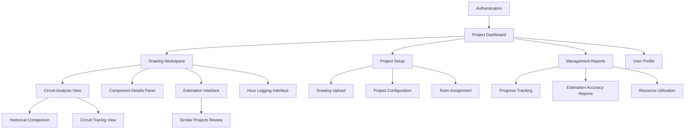
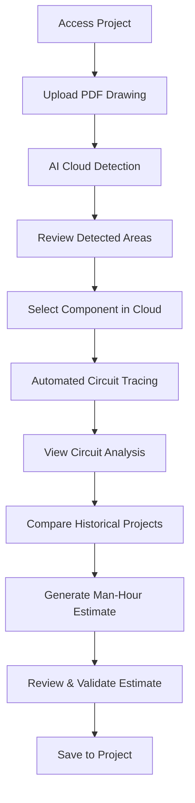

# ELECTRICAL ORCHESTRATOR UI/UX Specification

## Introduction

This document defines the user experience goals, information architecture, user flows, and visual design specifications for the ELECTRICAL ORCHESTRATOR - an AI-powered brownfield electrical estimation platform designed for oil & gas professionals. The interface prioritizes technical precision, professional workflows, and efficient circuit analysis capabilities.

- **Link to Primary Design Files:** *To be created in Figma following this specification*
- **Link to Deployed Storybook / Design System:** *To be developed during frontend implementation*

## Overall UX Goals & Principles

### Target User Personas

**Management Level Users:**
- **Electrical Leads:** Need efficient project overview, accurate estimation validation, and resource planning tools
- **FCO Leads:** Require instrumentation-focused circuit analysis and precise control system estimates
- **Foremen/General Foremen/Superintendents:** Need clear progress visibility and team coordination capabilities

**Execution Level Users:**
- **Electricians:** Need intuitive circuit exploration, clear component specifications, and simple hour logging
- **FCO Technicians:** Require detailed instrument circuit analysis and progress tracking

### Usability Goals
- **Professional Efficiency:** Minimize time from PDF upload to actionable estimation results
- **Technical Clarity:** Present complex electrical information in immediately understandable formats
- **Workflow Integration:** Support natural electrical project workflows from analysis to completion tracking
- **Error Prevention:** Guide users through complex technical processes with clear validation and feedback

### Design Principles
1. **Technical Precision Over Aesthetic Flourish:** Interface conveys reliability and accuracy appropriate for engineering decisions
2. **Progressive Disclosure:** Reveal technical complexity incrementally based on user role and task depth
3. **Context-Aware Information:** Surface relevant component data, specifications, and historical insights contextually
4. **Consistent Professional Patterns:** Leverage familiar CAD and project management interface conventions
5. **Immediate Feedback:** Provide clear system status, processing progress, and validation results

## Information Architecture (IA)

### Site Map / Screen Inventory

### Navigation Structure

**Primary Navigation (Top Bar):**
- Project selector dropdown with search
- Main navigation: Dashboard | Workspace | Reports | Settings
- User profile with role indicator and notifications
- System status indicators (processing queue, connectivity)

**Secondary Navigation (Context Sidebar):**
- Drawing navigation panel with thumbnail view
- Component hierarchy tree
- Circuit analysis tools
- Quick action buttons (estimate, log hours, export)

**Workspace Navigation:**
- Drawing layer controls and zoom tools
- Cloud area selector and detection settings
- Circuit tracing mode toggles
- Analysis panel show/hide controls

## User Flows

### Primary Circuit Analysis Flow

**Goal:** Analyze a new electrical circuit for accurate man-hour estimation

**Steps / Diagram:**

### Component Exploration Flow

**Goal:** Understand electrical component specifications and connections

**Steps:**
1. User clicks on any electrical component in drawing
2. System highlights component and opens specification panel
3. Component details display: type, ratings, manufacturer, part numbers
4. Related connections show with visual path highlighting
5. User can follow connections to related components
6. Historical usage data and lessons learned surface contextually
7. User can add notes or flag issues for team awareness

### Hour Logging Flow

**Goal:** Field technician logs actual work hours against specific circuits

**Steps:**
1. Technician accesses mobile-optimized interface
2. Selects active project and assigned circuits
3. Starts timer or enters manual hours
4. Associates time with specific circuit components
5. Adds photos or notes documenting work progress
6. Submits entry with automatic validation
7. System updates progress tracking and variance calculations

### Estimation Review Flow

**Goal:** Management validates and approves project estimates

**Steps:**
1. Management user accesses estimation interface
2. Reviews AI-generated estimates with confidence scores
3. Compares against similar historical projects
4. Examines circuit complexity and risk factors
5. Adjusts estimates based on project-specific factors
6. Approves final estimates with electronic signature
7. System distributes approved estimates to project team

## Wireframes & Mockups

### Drawing Workspace (Primary Interface)

**Layout Description:**
- **Header Bar (60px):** Project navigation, user profile, system status
- **Sidebar Left (320px):** Drawing thumbnails, component tree, analysis tools
- **Main Canvas (flexible):** Interactive PDF viewer with circuit highlighting
- **Panel Right (380px):** Component specifications, estimation results, historical data
- **Footer Bar (40px):** Zoom controls, drawing coordinates, processing status

**Key Interactive Elements:**
- PDF canvas with pan, zoom, and component selection
- Component highlighting with animated circuit path tracing
- Contextual panels that adapt content based on selected elements
- Quick action floating buttons for common operations

### Circuit Analysis View

**Layout Focus:**
- **Circuit Diagram (60% width):** Simplified schematic view of traced circuit
- **Component List (40% width):** Hierarchical list with specifications and quantities
- **Analysis Summary (bottom panel):** Complexity metrics, estimation breakdown, historical comparisons

### Project Dashboard

**Layout Components:**
- **Summary Cards:** Active projects, estimation accuracy trends, team productivity
- **Progress Charts:** Project timeline, budget variance, completion forecasts
- **Quick Actions:** Upload new drawing, create estimate, review pending approvals
- **Recent Activity:** Team updates, completed circuits, estimation updates

## Component Library / Design System Reference

### Core Components

**Buttons:**
- Primary Action: Maroon background (#8B1538), white text, 52px height
- Secondary Action: Maroon border, transparent background, 52px height
- Technical Action: Tech Blue background (#2196F3), white text, 48px height
- Icon Button: 44px square, various contexts

**Cards:**
- Project Card: White background, subtle shadow, 16px radius
- Drawing Card: Light tech background (#FAFBFC), 12px radius
- Component Card: White background, minimal shadow, 8px radius

**Input Fields:**
- Standard Input: 56px height, 12px radius, responsive border states
- Technical Input: 48px height, tech background, monospace font
- Search Input: With integrated icon and autocomplete

**Data Visualization:**
- Progress Bars: Circuit completion, estimation accuracy, budget variance
- Status Indicators: Processing states, validation results, system health
- Interactive Charts: Historical trends, project comparisons, productivity metrics

## Branding & Style Guide Reference

### Color Palette

**Primary Colors:**
- Primary White: #FAFBFC (Clean backgrounds and primary surfaces)
- Primary Maroon: #8B1538 (Primary brand color for key actions and emphasis)

**Secondary Colors:**
- Secondary Maroon Light: #B8456B (Hover states and secondary interactive elements)
- Secondary Maroon Pale: #F5E8ED (Backgrounds, selected states, and subtle highlights)

**Accent Colors:**
- Accent Tech Blue: #2196F3 (Technical actions, circuit highlighting, and analysis features)
- Accent Orange: #FF9800 (Warnings, alerts, and drawing annotations)

**Functional Colors:**
- Success Green: #4CAF50 (Successful uploads, completions, and confirmations)
- Error Red: #F44336 (Errors, validation failures, and destructive actions)
- Warning Amber: #FFC107 (Caution states and important notices)
- Info Cyan: #00BCD4 (Information states and neutral notifications)

**Technical Colors:**
- Circuit Green: #009688 (Active circuits and electrical flow indicators)
- Neutral Gray: #757575 (Secondary text and disabled states)
- Dark Gray: #212121 (Primary text and technical annotations)

### Typography

**Font Families:**
- Primary Font: SF Pro Text (iOS) / Roboto (Android) / Segoe UI (Windows)
- Technical Font: SF Mono (iOS) / Roboto Mono (Android) / Consolas (Windows)
- Web Fallback: Inter

**Text Styles:**
- H1: 32px/36px, Bold, Letter spacing -0.3px (Main screen titles)
- H2: 26px/30px, Bold, Letter spacing -0.2px (Project titles, major sections)
- H3: 22px/26px, Semibold, Letter spacing -0.1px (Drawing titles, component categories)
- H4: 18px/22px, Semibold (Subsections and panel labels)
- Body Large: 17px/24px, Regular (Primary text for technical details)
- Body: 15px/21px, Regular (Standard UI text)
- Body Small: 13px/18px, Regular (Secondary information)
- Technical: 14px/20px, Medium, Technical Font (Component codes, measurements)
- Caption: 12px/16px, Medium (Timestamps, file sizes, labels)

### Spacing System
- 2dp: Minimal spacing (tight element groupings)
- 8dp: Small spacing (internal component padding)
- 16dp: Default spacing (standard margins and padding)
- 24dp: Medium spacing (section separations)
- 32dp: Large spacing (major section divisions)
- 48dp: Extra large spacing (screen padding top/bottom)

## Accessibility (AX) Requirements

### Target Compliance
**WCAG 2.1 AA** compliance with specific focus on technical professional needs

### Specific Requirements

**Keyboard Navigation:**
- Full functionality accessible via keyboard shortcuts
- Tab order follows logical reading flow
- Escape key cancels modal operations
- Arrow keys navigate component selections
- Enter key activates primary actions

**Visual Accessibility:**
- Minimum 4.5:1 contrast ratio for all text
- High contrast mode support for technical drawings
- Color-blind friendly circuit highlighting (patterns + colors)
- Scalable interface supporting 200% zoom
- Clear focus indicators with 2px maroon outline

**Screen Reader Support:**
- ARIA landmarks for main interface sections
- Alt text for all technical diagrams and circuit visualizations
- Role definitions for custom interactive components
- Status announcements for processing operations
- Table headers for component specification data

**Motor Accessibility:**
- Minimum 44px touch targets for all interactive elements
- Hover states that don't rely solely on mouse position
- Drag operations with keyboard alternatives
- Adjustable timeout settings for technical operations

## Responsiveness

### Breakpoints
- **Mobile:** 320px - 767px (Basic functionality, hour logging focus)
- **Tablet:** 768px - 1023px (Drawing review, field interface)
- **Desktop Small:** 1024px - 1439px (Full workspace, single monitor)
- **Desktop Large:** 1440px+ (Multi-panel workspace, dual monitors)

### Adaptation Strategy

**Mobile (320px - 767px):**
- Single-column layout with collapsible sections
- Bottom tab navigation for main functions
- Simplified drawing viewer with gesture controls
- Focus on hour logging and basic project status

**Tablet (768px - 1023px):**
- Two-column layout with collapsible sidebar
- Touch-optimized drawing interaction
- Component panels as overlays or bottom sheets
- Landscape orientation optimized for drawing review

**Desktop Small (1024px - 1439px):**
- Three-column layout: navigation | workspace | details
- Full PDF interaction with mouse precision
- Integrated panels with resize handles
- Optimized for single monitor professional setups

**Desktop Large (1440px+):**
- Multi-panel workspace with drag-and-drop organization
- Side-by-side drawing and schematic views
- Advanced multi-monitor support with panel detachment
- Power user shortcuts and batch operations

## Change Log

| Change | Date | Version | Description | Author |
| ------ | ---- | ------- | ----------- | ------ |
| Initial UI/UX Specification | 2025-01-25 | 1.0 | Complete UI/UX specification created from PRD requirements using BMAD methodology | Design Architect (BMAD Agent) |