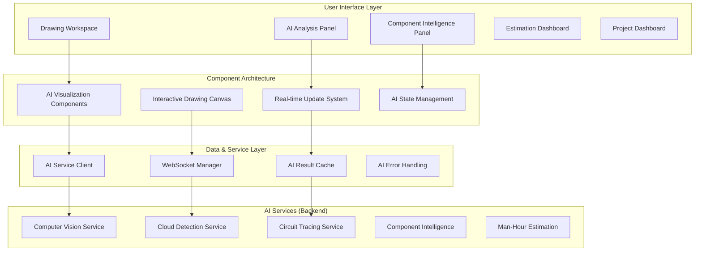

# Frontend AI Architecture - Electrical Orchestrator
**Document Version:** 1.0  
**Created:** 2025-05-28  
**Design Architect:** Millie (BMAD Method)  
**Dependencies:** AI Services Architecture (Mo)

## Executive Summary

This document defines the comprehensive frontend architecture for AI-powered electrical drawing analysis, enabling seamless interaction with Computer Vision, Cloud Detection, Circuit Tracing, Component Intelligence, and Man-Hour Estimation services through intuitive, high-performance user interfaces.

## Frontend Philosophy & Design Principles

### Core AI-UX Philosophy
**"Intelligent Transparency"** - AI capabilities should feel natural and integrated, not overwhelming. Users should understand what the AI is doing and maintain control over the analysis process.

### Key Design Principles
1. **Progressive Disclosure** - Complex AI features revealed contextually as needed
2. **Real-time Feedback** - Immediate visual response to AI processing
3. **Confidence Communication** - Clear indication of AI prediction confidence
4. **Graceful Fallbacks** - Manual alternatives when AI services unavailable
5. **Performance First** - Optimized for large technical drawings and real-time interactions

## Overall Frontend Architecture Overview



## Technology Stack & Framework Decisions

### Core Framework
**Next.js 14 with App Router** (Current - Maintained)
- **Rationale**: Already established, excellent for server-side rendering of technical drawings
- **AI Enhancement**: Perfect for progressive loading of AI analysis results
- **Performance**: Built-in image optimization crucial for large electrical drawings

### AI-Specific Frontend Technologies

#### Canvas & Visualization
```typescript
// Primary drawing rendering stack
const DrawingTechStack = {
  canvas: 'HTML5 Canvas + Fabric.js',
  pdfRendering: 'PDF.js + React-PDF',
  vectorGraphics: 'SVG overlays for AI annotations',
  webGL: 'Three.js for 3D circuit visualization (Phase 2)',
  charts: 'D3.js for analysis dashboards'
};
```

#### Real-time AI Communication
```typescript
// WebSocket management for AI services
const AICommStack = {
  websockets: 'Socket.io for real-time AI updates',
  httpClient: 'Axios with retry logic for AI API calls',
  streaming: 'Server-Sent Events for progress updates',
  offline: 'Service Workers for offline AI result caching'
};
```

#### State Management for AI Data
```typescript
// Complex AI state management
const StateStack = {
  global: 'Zustand for AI service state',
  server: 'TanStack Query for AI result caching',
  canvas: 'Fabric.js internal state for drawing interactions',
  realTime: 'Socket.io client state for live updates'
};
```

## Frontend Directory Structure

```
src/frontend/
├── app/                          # Next.js App Router
│   ├── (dashboard)/             # Dashboard route group
│   │   ├── projects/            # Project management
│   │   └── analytics/           # AI analytics dashboards
│   ├── (workspace)/             # Drawing workspace group
│   │   ├── drawing/[id]/        # Individual drawing analysis
│   │   ├── circuit-trace/       # Circuit tracing interface
│   │   └── component-search/    # Component intelligence search
│   ├── (ai-admin)/             # AI service administration
│   │   ├── model-management/    # AI model versions
│   │   └── training-data/       # Training data management
│   └── api/                     # API routes for AI proxying
├── components/                   # React components
│   ├── ai/                      # AI-specific components
│   │   ├── drawing-canvas/      # Interactive drawing canvas
│   │   ├── circuit-tracer/      # Circuit path visualization
│   │   ├── component-detector/  # Component recognition UI
│   │   ├── cloud-detector/      # Change detection overlays
│   │   ├── estimation-engine/   # Man-hour estimation UI
│   │   └── ai-feedback/         # AI confidence indicators
│   ├── ui/                      # Base UI components
│   │   ├── overlays/           # Modal and overlay components
│   │   ├── charts/             # D3.js chart components
│   │   ├── loading/            # AI processing indicators
│   │   └── forms/              # Form components
│   ├── layout/                  # Layout components
│   │   ├── workspace-layout/   # Drawing workspace layout
│   │   ├── dashboard-layout/   # Dashboard layout
│   │   └── ai-sidebar/         # AI tools sidebar
│   └── shared/                  # Shared utility components
├── hooks/                       # Custom React hooks
│   ├── ai/                      # AI-specific hooks
│   │   ├── useCircuitTracing.ts
│   │   ├── useComponentDetection.ts
│   │   ├── useCloudDetection.ts
│   │   ├── useAIEstimation.ts
│   │   └── useAIWebSocket.ts
│   ├── canvas/                  # Canvas interaction hooks
│   │   ├── useDrawingCanvas.ts
│   │   ├── useCanvasZoom.ts
│   │   └── useCanvasSelection.ts
│   └── data/                    # Data fetching hooks
├── services/                    # External service integrations
│   ├── ai/                      # AI service clients
│   │   ├── computerVision.ts
│   │   ├── cloudDetection.ts
│   │   ├── circuitTracing.ts
│   │   ├── componentIntelligence.ts
│   │   └── estimationEngine.ts
│   ├── websocket/              # WebSocket management
│   │   ├── aiWebSocketClient.ts
│   │   └── drawingCollaboration.ts
│   └── storage/                # Local storage utilities
├── stores/                     # Global state management
│   ├── aiAnalysisStore.ts      # AI analysis results
│   ├── drawingStore.ts         # Drawing state and interactions
│   ├── componentStore.ts       # Component intelligence data
│   ├── estimationStore.ts      # Project estimation state
│   └── userPreferencesStore.ts # User AI preferences
├── types/                      # TypeScript definitions
│   ├── ai/                     # AI service types
│   │   ├── computerVision.ts
│   │   ├── circuitTracing.ts
│   │   └── componentTypes.ts
│   ├── canvas/                 # Canvas interaction types
│   └── api/                    # API response types
├── utils/                      # Utility functions
│   ├── ai/                     # AI-specific utilities
│   │   ├── confidenceCalculator.ts
│   │   ├── coordinateTransform.ts
│   │   └── aiResultFormatter.ts
│   ├── canvas/                 # Canvas utilities
│   │   ├── fabricUtils.ts
│   │   ├── pdfRenderer.ts
│   │   └── annotationHelpers.ts
│   └── performance/            # Performance utilities
└── styles/                     # Styling
    ├── ai-components.css       # AI component specific styles
    ├── canvas.css              # Canvas and drawing styles
    └── dashboards.css          # Dashboard and analytics styles
```

## Component Architecture Strategy

### AI Visualization Component Hierarchy

```typescript
// Core AI visualization component structure
interface AIComponentArchitecture {
  // Level 1: Page Components
  DrawingWorkspacePage: {
    children: [
      'DrawingCanvas',
      'AIToolsSidebar', 
      'ComponentDetailsPanel',
      'AnalysisProgressIndicator'
    ]
  };
  
  // Level 2: Feature Components  
  DrawingCanvas: {
    children: [
      'PDFRenderer',
      'AIOverlayManager',
      'InteractionHandler',
      'ZoomController'
    ]
  };
  
  // Level 3: AI-specific Components
  AIOverlayManager: {
    children: [
      'ComponentDetectionOverlay',
      'CloudDetectionOverlay', 
      'CircuitTracingOverlay',
      'ConfidenceIndicators'
    ]
  };
}
```

### Component Specification Template

```typescript
/**
 * AI Component Template
 * All AI components must follow this structure
 */
interface AIComponentSpec<TProps, TState> {
  // Component metadata
  name: string;
  purpose: string;
  aiServiceDependencies: AIService[];
  
  // Props interface
  props: TProps;
  
  // Internal state (if stateful)
  state?: TState;
  
  // AI-specific concerns
  confidenceThreshold: number;
  fallbackBehavior: FallbackStrategy;
  performanceRequirements: PerformanceSpec;
  
  // Accessibility requirements
  accessibility: AccessibilitySpec;
  
  // Testing requirements  
  testingStrategy: ComponentTestSpec;
}

// Example implementation
const ComponentDetectionOverlay: AIComponentSpec<
  ComponentDetectionProps,
  ComponentDetectionState
> = {
  name: 'ComponentDetectionOverlay',
  purpose: 'Visualize AI-detected electrical components with bounding boxes',
  aiServiceDependencies: ['ComputerVisionService'],
  confidenceThreshold: 0.75,
  fallbackBehavior: 'graceful-degradation',
  performanceRequirements: {
    renderTime: '<100ms',
    memoryUsage: '<50MB'
  }
  // ... rest of specification
};
```

## State Management Architecture

### AI State Management Strategy

```typescript
// Zustand stores for AI functionality
interface AIStateArchitecture {
  // Global AI analysis state
  aiAnalysisStore: {
    currentAnalysis: AnalysisSession | null;
    analysisHistory: AnalysisSession[];
    processingQueue: AITask[];
    globalConfidenceThreshold: number;
  };
  
  // Drawing-specific state
  drawingStore: {
    currentDrawing: DrawingDocument | null;
    canvasState: FabricCanvasState;
    selectedComponents: Component[];
    activeCircuitTrace: CircuitPath | null;
  };
  
  // Component intelligence state
  componentStore: {
    detectedComponents: ComponentDetection[];
    componentDatabase: ComponentCatalog;
    searchResults: ComponentSearchResult[];
    favoriteComponents: Component[];
  };
  
  // Real-time AI updates
  websocketStore: {
    connectionStatus: WebSocketStatus;
    activeSubscriptions: AISubscription[];
    realtimeUpdates: AIUpdate[];
  };
}
```

### State Management Implementation

```typescript
// Primary AI analysis store
import { create } from 'zustand';
import { subscribeWithSelector } from 'zustand/middleware';

interface AIAnalysisState {
  // Current analysis session
  currentAnalysis: AnalysisSession | null;
  
  // AI service results
  componentDetections: ComponentDetection[];
  cloudDetections: CloudDetection[];
  circuitTraces: CircuitTrace[];
  hourEstimations: HourEstimation[];
  
  // Processing state
  isProcessing: boolean;
  processingStage: AIProcessingStage;
  confidence: ConfidenceMetrics;
  
  // Actions
  startAnalysis: (drawingId: string) => Promise<void>;
  updateComponentDetections: (detections: ComponentDetection[]) => void;
  updateCloudDetections: (detections: CloudDetection[]) => void;
  addCircuitTrace: (trace: CircuitTrace) => void;
  updateEstimation: (estimation: HourEstimation) => void;
  clearAnalysis: () => void;
}

export const useAIAnalysisStore = create<AIAnalysisState>()(
  subscribeWithSelector((set, get) => ({
    // Initial state
    currentAnalysis: null,
    componentDetections: [],
    cloudDetections: [],
    circuitTraces: [],
    hourEstimations: [],
    isProcessing: false,
    processingStage: 'idle',
    confidence: { overall: 0, byService: {} },
    
    // Actions
    startAnalysis: async (drawingId: string) => {
      set({ isProcessing: true, processingStage: 'initializing' });
      
      try {
        // Initialize analysis session
        const session = await aiAnalysisService.startAnalysis(drawingId);
        set({ 
          currentAnalysis: session,
          processingStage: 'component-detection'
        });
        
        // Subscribe to real-time updates
        aiWebSocketService.subscribeToAnalysis(session.id);
        
      } catch (error) {
        set({ isProcessing: false, processingStage: 'error' });
        throw error;
      }
    },
    
    updateComponentDetections: (detections) => {
      set({ 
        componentDetections: detections,
        processingStage: 'cloud-detection',
        confidence: {
          ...get().confidence,
          byService: {
            ...get().confidence.byService,
            computerVision: calculateAverageConfidence(detections)
          }
        }
      });
    },
    
    // ... other actions
  }))
);
```

## API Interaction Layer

### AI Service Client Architecture

```typescript
// Centralized AI service communication
class AIServiceClient {
  private httpClient: AxiosInstance;
  private websocketManager: WebSocketManager;
  private cacheManager: CacheManager;
  
  constructor() {
    this.httpClient = axios.create({
      baseURL: process.env.NEXT_PUBLIC_AI_GATEWAY_URL,
      timeout: 30000, // 30 second timeout for AI operations
      retries: 3,
      retryDelay: (retryCount) => retryCount * 1000
    });
    
    this.setupInterceptors();
  }
  
  // Computer Vision Service integration
  async analyzeDrawing(
    drawingId: string,
    options?: AnalysisOptions
  ): Promise<ComponentDetectionResult> {
    const cacheKey = `cv-analysis-${drawingId}`;
    const cached = await this.cacheManager.get(cacheKey);
    
    if (cached && !options?.forceRefresh) {
      return cached;
    }
    
    const result = await this.httpClient.post('/api/v1/cv/analyze-drawing', {
      drawing_id: drawingId,
      confidence_threshold: options?.confidenceThreshold || 0.75,
      include_text_extraction: options?.includeText || true
    });
    
    await this.cacheManager.set(cacheKey, result.data, { ttl: 3600 });
    return result.data;
  }
  
  // Circuit Tracing Service integration
  async traceCircuit(
    componentId: string,
    traceDirection: 'upstream' | 'downstream' | 'bidirectional'
  ): Promise<CircuitTraceResult> {
    return this.httpClient.post('/api/v1/circuit/trace-path', {
      component_id: componentId,
      direction: traceDirection,
      max_depth: 10,
      include_specifications: true
    });
  }
  
  // Real-time AI updates via WebSocket
  subscribeToAnalysis(
    analysisId: string,
    callbacks: AIUpdateCallbacks
  ): WebSocketSubscription {
    return this.websocketManager.subscribe(`analysis:${analysisId}`, {
      onComponentDetected: callbacks.onComponentDetected,
      onCloudDetected: callbacks.onCloudDetected,
      onCircuitTraced: callbacks.onCircuitTraced,
      onEstimationUpdated: callbacks.onEstimationUpdated,
      onError: callbacks.onError,
      onComplete: callbacks.onComplete
    });
  }
}
```

### Error Handling Strategy

```typescript
// AI-specific error handling
interface AIErrorHandling {
  // Error types specific to AI services
  errorTypes: {
    'MODEL_UNAVAILABLE': 'AI model temporarily unavailable',
    'CONFIDENCE_TOO_LOW': 'AI prediction confidence below threshold',
    'PROCESSING_TIMEOUT': 'AI analysis timed out',
    'INVALID_DRAWING': 'Drawing format not supported by AI',
    'QUOTA_EXCEEDED': 'AI service usage quota exceeded'
  };
  
  // Recovery strategies
  recoveryStrategies: {
    'MODEL_UNAVAILABLE': 'fallback-to-cached' | 'retry-with-delay',
    'CONFIDENCE_TOO_LOW': 'request-manual-verification',
    'PROCESSING_TIMEOUT': 'retry-with-smaller-batch',
    'INVALID_DRAWING': 'preprocessor-cleanup',
    'QUOTA_EXCEEDED': 'queue-for-later'
  };
}

// Error boundary for AI components
export class AIErrorBoundary extends React.Component<
  AIErrorBoundaryProps,
  AIErrorBoundaryState
> {
  constructor(props: AIErrorBoundaryProps) {
    super(props);
    this.state = { hasError: false, error: null, errorInfo: null };
  }
  
  static getDerivedStateFromError(error: Error): AIErrorBoundaryState {
    return {
      hasError: true,
      error,
      errorInfo: null
    };
  }
  
  componentDidCatch(error: Error, errorInfo: React.ErrorInfo) {
    // Log AI-specific errors
    aiErrorLogger.logError({
      error,
      errorInfo,
      context: 'ai-component',
      userId: this.props.userId,
      drawingId: this.props.drawingId,
      aiService: this.props.aiService
    });
    
    this.setState({ errorInfo });
  }
  
  render() {
    if (this.state.hasError) {
      return (
        <AIErrorFallback
          error={this.state.error}
          onRetry={() => this.setState({ hasError: false })}
          fallbackMode={this.props.fallbackMode}
        />
      );
    }
    
    return this.props.children;
  }
}
```

## Routing Strategy

### AI-Focused Route Architecture

```typescript
// Next.js App Router structure for AI features
const AIRouteArchitecture = {
  // Main workspace routes
  '/workspace/drawing/[id]': {
    component: 'DrawingWorkspacePage',
    aiFeatures: ['component-detection', 'cloud-detection', 'circuit-tracing'],
    preload: ['drawing-data', 'ai-models'],
    websockets: ['analysis-updates', 'collaboration']
  },
  
  // Specialized AI analysis routes
  '/workspace/drawing/[id]/circuit-trace/[componentId]': {
    component: 'CircuitTracingPage',
    aiFeatures: ['circuit-tracing', 'component-intelligence'],
    realtime: true
  },
  
  // AI administration routes
  '/ai-admin/models': {
    component: 'ModelManagementPage',
    permissions: ['ai-admin'],
    aiFeatures: ['model-registry', 'performance-metrics']
  },
  
  // Component intelligence routes
  '/components/search': {
    component: 'ComponentSearchPage',
    aiFeatures: ['component-intelligence', 'semantic-search'],
    preload: ['component-database']
  }
};

// Route guards for AI features
export const AIRouteGuard: React.FC<AIRouteGuardProps> = ({
  children,
  requiredAIServices,
  fallbackComponent
}) => {
  const { aiServicesStatus } = useAIServicesHealth();
  
  const allServicesAvailable = requiredAIServices.every(
    service => aiServicesStatus[service] === 'healthy'
  );
  
  if (!allServicesAvailable) {
    return fallbackComponent || <AIServicesUnavailableError />;
  }
  
  return <>{children}</>;
};
```

## Performance Optimization Strategy

### AI-Specific Performance Requirements

```typescript
// Performance benchmarks for AI features
interface AIPerformanceTargets {
  // Drawing canvas performance
  canvasRendering: {
    initialLoad: '<2 seconds',
    zoom: '<100ms',
    panGesture: '<16ms', // 60fps
    componentOverlay: '<200ms'
  };
  
  // AI service response times
  aiServices: {
    componentDetection: '<5 seconds',
    cloudDetection: '<3 seconds', 
    circuitTracing: '<2 seconds',
    componentSearch: '<500ms',
    estimationCalculation: '<1 second'
  };
  
  // Memory management
  memory: {
    drawingCache: '<200MB',
    aiResultsCache: '<100MB',
    canvasObjects: '<50MB',
    totalHeapSize: '<500MB'
  };
}
```

### Performance Implementation

```typescript
// Optimized canvas rendering with AI overlays
export const OptimizedDrawingCanvas: React.FC<DrawingCanvasProps> = ({
  drawingId,
  aiDetections
}) => {
  // Virtual rendering for large drawings
  const { visibleRegion, renderableObjects } = useVirtualCanvas({
    canvasSize: drawingDimensions,
    viewportSize: containerDimensions,
    objects: allCanvasObjects
  });
  
  // Debounced AI overlay updates
  const debouncedAIUpdate = useMemo(
    () => debounce((detections: ComponentDetection[]) => {
      updateCanvasOverlays(detections);
    }, 150),
    []
  );
  
  // Memory-efficient component detection rendering
  const renderComponentDetections = useCallback((detections: ComponentDetection[]) => {
    // Only render detections in visible region
    const visibleDetections = detections.filter(detection =>
      isInViewport(detection.boundingBox, visibleRegion)
    );
    
    // Use object pooling for detection overlays
    return objectPool.render('component-detection', visibleDetections);
  }, [visibleRegion]);
  
  // WebGL acceleration for complex visualizations
  const { webglRenderer } = useWebGLCanvas({
    enabled: aiDetections.length > 1000,
    fallback: 'canvas-2d'
  });
  
  return (
    <div className="drawing-canvas-container">
      <canvas
        ref={canvasRef}
        width={canvasDimensions.width}
        height={canvasDimensions.height}
        onWheel={handleZoom}
        onMouseMove={handlePan}
      />
      
      {/* AI overlay layer */}
      <AIOverlayRenderer
        detections={aiDetections}
        visibleRegion={visibleRegion}
        performanceMode={webglRenderer ? 'webgl' : 'canvas'}
      />
    </div>
  );
};

// Intelligent caching for AI results
export const useAIResultsCache = () => {
  const cache = useMemo(() => new LRUCache<string, AIResult>({
    max: 100, // Maximum 100 cached results
    ttl: 1000 * 60 * 30, // 30 minute TTL
    updateAgeOnGet: true
  }), []);
  
  const getCachedResult = useCallback(async (
    cacheKey: string,
    fetcher: () => Promise<AIResult>
  ): Promise<AIResult> => {
    const cached = cache.get(cacheKey);
    if (cached) return cached;
    
    const result = await fetcher();
    cache.set(cacheKey, result);
    return result;
  }, [cache]);
  
  return { getCachedResult, clearCache: () => cache.clear() };
};
```

## Real-time AI Updates Architecture

### WebSocket Management for AI Services

```typescript
// Real-time AI processing updates
export class AIWebSocketManager {
  private connections: Map<string, WebSocket>;
  private subscriptions: Map<string, AISubscription>;
  private reconnectAttempts: Map<string, number>;
  
  constructor(private config: AIWebSocketConfig) {
    this.connections = new Map();
    this.subscriptions = new Map();
    this.reconnectAttempts = new Map();
  }
  
  // Subscribe to AI analysis updates
  subscribeToAnalysis(
    analysisId: string,
    callbacks: AIAnalysisCallbacks
  ): AISubscription {
    const subscriptionId = `analysis-${analysisId}-${Date.now()}`;
    
    const subscription: AISubscription = {
      id: subscriptionId,
      analysisId,
      callbacks,
      status: 'connecting'
    };
    
    this.subscriptions.set(subscriptionId, subscription);
    this.establishConnection(analysisId, subscription);
    
    return subscription;
  }
  
  private establishConnection(
    analysisId: string,
    subscription: AISubscription
  ): void {
    const wsUrl = `${this.config.wsEndpoint}/analysis/${analysisId}`;
    const ws = new WebSocket(wsUrl);
    
    ws.onopen = () => {
      subscription.status = 'connected';
      this.reconnectAttempts.set(analysisId, 0);
      
      // Send subscription message
      ws.send(JSON.stringify({
        type: 'subscribe',
        analysisId,
        subscriptionId: subscription.id
      }));
    };
    
    ws.onmessage = (event) => {
      const update: AIUpdate = JSON.parse(event.data);
      this.handleAIUpdate(update, subscription);
    };
    
    ws.onclose = () => {
      this.handleReconnection(analysisId, subscription);
    };
    
    ws.onerror = (error) => {
      subscription.callbacks.onError?.(error);
    };
    
    this.connections.set(analysisId, ws);
  }
  
  private handleAIUpdate(update: AIUpdate, subscription: AISubscription): void {
    switch (update.type) {
      case 'component-detected':
        subscription.callbacks.onComponentDetected?.(update.data);
        break;
      case 'cloud-detected':
        subscription.callbacks.onCloudDetected?.(update.data);
        break;
      case 'circuit-traced':
        subscription.callbacks.onCircuitTraced?.(update.data);
        break;
      case 'estimation-updated':
        subscription.callbacks.onEstimationUpdated?.(update.data);
        break;
      case 'analysis-complete':
        subscription.callbacks.onComplete?.(update.data);
        this.cleanup(subscription.analysisId);
        break;
      case 'error':
        subscription.callbacks.onError?.(update.error);
        break;
    }
  }
}

// React hook for AI WebSocket integration
export const useAIAnalysisUpdates = (analysisId: string) => {
  const [updates, setUpdates] = useState<AIUpdate[]>([]);
  const [connectionStatus, setConnectionStatus] = useState<WebSocketStatus>('disconnected');
  
  const webSocketManager = useMemo(() => new AIWebSocketManager({
    wsEndpoint: process.env.NEXT_PUBLIC_AI_WS_ENDPOINT!
  }), []);
  
  useEffect(() => {
    if (!analysisId) return;
    
    const subscription = webSocketManager.subscribeToAnalysis(analysisId, {
      onComponentDetected: (detection) => {
        setUpdates(prev => [...prev, { type: 'component-detected', data: detection }]);
      },
      onCloudDetected: (detection) => {
        setUpdates(prev => [...prev, { type: 'cloud-detected', data: detection }]);
      },
      onCircuitTraced: (trace) => {
        setUpdates(prev => [...prev, { type: 'circuit-traced', data: trace }]);
      },
      onEstimationUpdated: (estimation) => {
        setUpdates(prev => [...prev, { type: 'estimation-updated', data: estimation }]);
      },
      onComplete: (result) => {
        setUpdates(prev => [...prev, { type: 'analysis-complete', data: result }]);
        setConnectionStatus('completed');
      },
      onError: (error) => {
        console.error('AI analysis error:', error);
        setConnectionStatus('error');
      }
    });
    
    setConnectionStatus('connected');
    
    return () => {
      webSocketManager.unsubscribe(subscription.id);
      setConnectionStatus('disconnected');
    };
  }, [analysisId, webSocketManager]);
  
  return { updates, connectionStatus };
};
```

## Testing Strategy for AI Components

### AI Component Testing Framework

```typescript
// Testing utilities for AI components
export const AITestingUtils = {
  // Mock AI service responses
  mockAIServices: {
    computerVision: {
      success: (): ComponentDetectionResult => ({
        components: [
          {
            id: 'test-component-1',
            type: 'breaker',
            confidence: 0.92,
            boundingBox: { x: 100, y: 100, width: 50, height: 30 },
            specifications: { voltage: 480, amperage: 20 }
          }
        ],
        processingTime: 1200,
        modelVersion: 'test-v1.0'
      }),
      
      lowConfidence: (): ComponentDetectionResult => ({
        components: [
          {
            id: 'test-component-low',
            type: 'unknown',
            confidence: 0.45,
            boundingBox: { x: 200, y: 200, width: 30, height: 20 }
          }
        ],
        processingTime: 800,
        modelVersion: 'test-v1.0'
      }),
      
      error: (): never => {
        throw new Error('AI_SERVICE_UNAVAILABLE');
      }
    }
  },
  
  // Canvas testing utilities
  canvas: {
    createMockCanvas: (width = 800, height = 600) => {
      const canvas = document.createElement('canvas');
      canvas.width = width;
      canvas.height = height;
      return canvas;
    },
    
    simulateCanvasInteraction: (canvas: HTMLCanvasElement, interaction: CanvasInteraction) => {
      const event = new MouseEvent(interaction.type, {
        clientX: interaction.x,
        clientY: interaction.y,
        bubbles: true
      });
      canvas.dispatchEvent(event);
    }
  },
  
  // WebSocket testing
  websocket: {
    createMockWebSocket: (): MockWebSocket => ({
      send: jest.fn(),
      close: jest.fn(),
      addEventListener: jest.fn(),
      removeEventListener: jest.fn(),
      readyState: WebSocket.OPEN
    })
  }
};

// Example AI component test
describe('ComponentDetectionOverlay', () => {
  let mockAIService: jest.Mocked<ComputerVisionService>;
  
  beforeEach(() => {
    mockAIService = {
      analyzeDrawing: jest.fn(),
      detectComponents: jest.fn()
    } as jest.Mocked<ComputerVisionService>;
  });
  
  it('should render component detections with correct confidence', async () => {
    const mockDetections = AITestingUtils.mockAIServices.computerVision.success();
    mockAIService.detectComponents.mockResolvedValue(mockDetections);
    
    render(
      <ComponentDetectionOverlay
        drawingId="test-drawing"
        aiService={mockAIService}
        confidenceThreshold={0.8}
      />
    );
    
    await waitFor(() => {
      expect(screen.getByTestId('component-detection-1')).toBeInTheDocument();
    });
    
    const detectionElement = screen.getByTestId('component-detection-1');
    expect(detectionElement).toHaveAttribute('data-confidence', '0.92');
    expect(detectionElement).toHaveClass('high-confidence');
  });
  
  it('should handle low confidence detections appropriately', async () => {
    const mockDetections = AITestingUtils.mockAIServices.computerVision.lowConfidence();
    mockAIService.detectComponents.mockResolvedValue(mockDetections);
    
    render(
      <ComponentDetectionOverlay
        drawingId="test-drawing"
        aiService={mockAIService}
        confidenceThreshold={0.8}
      />
    );
    
    await waitFor(() => {
      expect(screen.queryByTestId('component-detection-low')).not.toBeInTheDocument();
    });
    
    // Should show low confidence indicator instead
    expect(screen.getByTestId('low-confidence-warning')).toBeInTheDocument();
  });
  
  it('should gracefully handle AI service errors', async () => {
    mockAIService.detectComponents.mockRejectedValue(new Error('AI_SERVICE_UNAVAILABLE'));
    
    render(
      <ComponentDetectionOverlay
        drawingId="test-drawing"
        aiService={mockAIService}
      />
    );
    
    await waitFor(() => {
      expect(screen.getByTestId('ai-error-fallback')).toBeInTheDocument();
    });
    
    expect(screen.getByText(/AI service temporarily unavailable/)).toBeInTheDocument();
  });
});
```

## Build & Deployment Optimization

### AI-Optimized Build Configuration

```typescript
// Next.js configuration for AI features
const nextConfig: NextConfig = {
  // Experimental features for AI
  experimental: {
    serverComponentsExternalPackages: ['fabric', 'canvas'],
    webVitalsAttribution: ['CLS', 'LCP', 'FCP', 'FID', 'TTFB']
  },
  
  // Image optimization for technical drawings
  images: {
    domains: ['ai-gateway.electrical-orchestrator.com'],
    formats: ['image/avif', 'image/webp'],
    deviceSizes: [640, 750, 828, 1080, 1200, 1920, 2048, 3840],
    imageSizes: [16, 32, 48, 64, 96, 128, 256, 384]
  },
  
  // Webpack configuration for AI libraries
  webpack: (config, { buildId, dev, isServer }) => {
    // Canvas and AI library optimizations
    config.externals = config.externals || [];
    if (isServer) {
      config.externals.push('canvas', 'jsdom');
    }
    
    // Bundle splitting for AI services
    config.optimization.splitChunks.cacheGroups = {
      ...config.optimization.splitChunks.cacheGroups,
      aiServices: {
        test: /[\\/]services[\\/]ai[\\/]/,
        name: 'ai-services',
        chunks: 'all',
        priority: 10
      },
      canvasLibs: {
        test: /[\\/]node_modules[\\/](fabric|konva|paper)[\\/]/,
        name: 'canvas-libs',
        chunks: 'all',
        priority: 9
      }
    };
    
    return config;
  },
  
  // Performance optimizations
  swcMinify: true,
  modularizeImports: {
    '@ai/components': {
      transform: '@ai/components/{{member}}'
    }
  }
};
```

### Deployment Strategy

```yaml
# Docker optimization for AI frontend
FROM node:18-alpine AS base

# AI-specific dependencies
FROM base AS ai-deps
WORKDIR /app
COPY package*.json ./
RUN npm ci --only=production && npm cache clean --force

# Build stage with AI optimizations
FROM base AS builder
WORKDIR /app
COPY package*.json ./
RUN npm ci

COPY . .
# Build with AI feature flags
ENV NEXT_TELEMETRY_DISABLED 1
ENV NEXT_PUBLIC_AI_FEATURES_ENABLED true
RUN npm run build

# Production stage
FROM base AS runner
WORKDIR /app

ENV NODE_ENV production
ENV NEXT_TELEMETRY_DISABLED 1

# AI runtime optimizations
ENV NODE_OPTIONS="--max-old-space-size=2048"
ENV NEXT_PUBLIC_AI_MEMORY_LIMIT="1024"

COPY --from=ai-deps /app/node_modules ./node_modules
COPY --from=builder /app/.next/standalone ./
COPY --from=builder /app/.next/static ./.next/static

EXPOSE 3000
CMD ["node", "server.js"]
```

## Epic/Story Impact Analysis

### New Frontend Stories Required

Based on the AI frontend architecture, the following implementation stories are needed:

#### Epic 3: AI User Interface Implementation

**Story 3.1: Interactive Drawing Canvas with AI Overlays**
- Implement Fabric.js canvas with PDF rendering
- Add AI detection overlay system
- Create zoom/pan controls optimized for large drawings
- Implement component selection and highlighting

**Story 3.2: Real-time AI Analysis Interface**
- Build WebSocket client for AI updates
- Create processing progress indicators
- Implement confidence threshold controls
- Add fallback UI for offline mode

**Story 3.3: Circuit Tracing Visualization**
- Develop interactive circuit path rendering
- Create component-to-component connection lines
- Implement bidirectional tracing UI
- Add circuit topology visualization

**Story 3.4: Component Intelligence Search Interface**
- Build advanced component search with filters
- Implement AI-powered semantic search
- Create component specification display panels
- Add component comparison features

**Story 3.5: AI Estimation Dashboard**
- Develop man-hour estimation visualization
- Create historical data comparison charts
- Implement confidence interval displays
- Add estimation refinement tools

### Existing Story Refinements

**Story 2.2: PDF Processing Enhancement**
- Add AI preprocessing pipeline integration
- Include canvas rendering optimization
- Specify AI overlay attachment points

## Architecture Validation Checklist

✅ **Framework & Core Libraries**: Next.js 14 with AI-optimized configuration  
✅ **Component Architecture**: Hierarchical AI component structure defined  
✅ **State Management**: Zustand stores for complex AI state management  
✅ **API Integration**: Comprehensive AI service client architecture  
✅ **Real-time Updates**: WebSocket management for AI processing  
✅ **Performance Optimization**: Canvas virtualization and caching strategies  
✅ **Error Handling**: AI-specific error boundaries and recovery  
✅ **Testing Strategy**: AI component testing framework  
✅ **Build & Deployment**: Optimized for AI libraries and performance  
✅ **Accessibility**: WCAG compliance for AI interfaces  
✅ **Security**: API authentication and data protection  

## Conclusion

This frontend architecture provides a comprehensive foundation for AI-powered electrical drawing analysis, balancing technical sophistication with user experience excellence. The modular design enables independent development of AI features while maintaining system cohesion.

**Next BMAD Steps:**
1. **Product Owner (Curly)** → Generate detailed implementation stories
2. **Frontend Developer (DevFE)** → Begin Interactive Drawing Canvas implementation
3. **Full Stack Developer (Dev)** → Integrate AI service clients

The architecture is optimized for the unique requirements of technical drawing analysis while providing the flexibility to scale across broader electrical engineering applications.